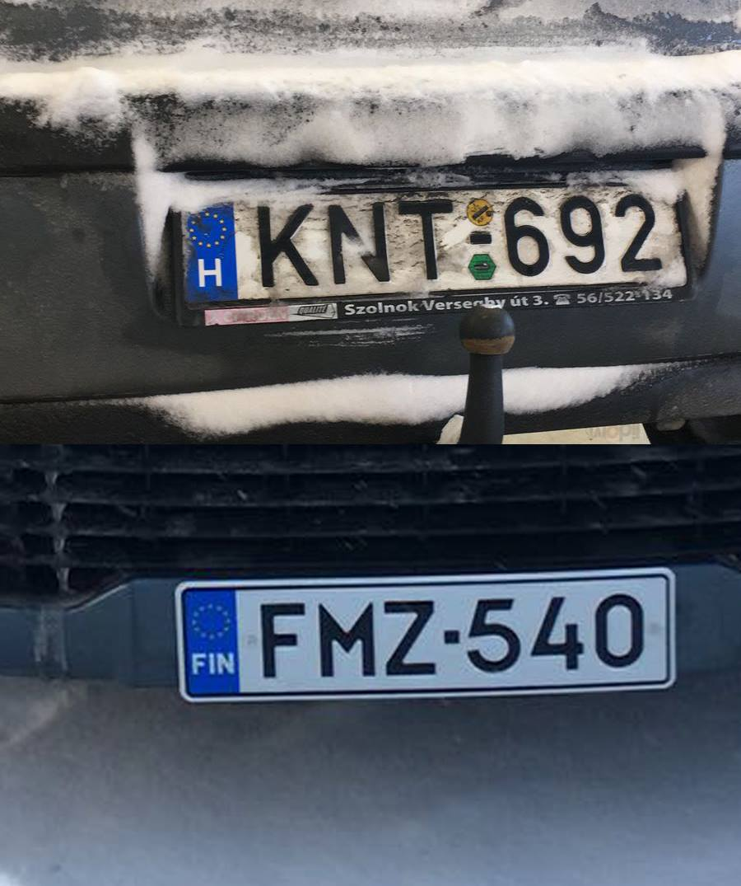

##Hogyan írassunk át magyar autót Finnországban?

Finnországban, egy másik EU-s tagországban forgalomba helyezett autót, 6+6 hónapig lehet adó és vámmentesen használni. Ezután kell elkezdeni, az egyébként rövidnek, olcsónak, és fájdalommentesnek sem nevezhető folyamatot. 

Mivel Finnországban sem lehet még EU-s állampolgárként sem 3 hónapnál tovább tartózkodni, akinek ilyen tervei vannak, ígyis-úgyis el kell mennie a _Migri_-be, ahol tartózkodási engedélyt kell igényelni, elmesélni, hogy milyen okból tartózkodik az országban, stb. Ez azért (is) fontos, mert a tartüzkodási engedéllyel együtt kapunk ún. _Henkilötunnus_t, ami lényegében a személyiigazolványuk száma lesz, és ami nélkül még egy internet előfizetést sem tudunk intézni egyébként. 

Amint ezt elintéztük, a rendőrségen kell bejelteni, hogy magyar (vagy más EU-s rendszámú) autót szeretnénk használni. Ekkor kapunk egy határozatot arról, hogy az autót 6 hónapig használhatjuk, majd ennek leteltével még egyszer 6 hónapra meghosszabítható. 

Az igazi izgalom a 2. 6 hónap leteltének közeledtével kezdődik. 

A Finnországban bejelentett lakcímünkre kapunk egy levelet a rendőrségtől, amiben értesítenek, hogy a használati engedély hamarosan lejár. Ha továbbra is használni szeretnénk az autónkat, itt az ideje, hogy átregisztráltassuk, és ezentúl Finnországban fizessünk adót. és biztosítást.

Ez egy viszonylag hosszú, fárasztó, és fájdalmas procedúra, hiszen én az égvilágon sehol nem találtam erről egy pomntokba szedett leírást, hogy hogyan is kellene ezt intézni, és a legtöbb hivatalban, az ügyintézők is azt a benyomást keltették benne, hogy én vagyok a világon az első, aki ilyet szeretne csinálni. 

Nézzük, hogyan is kell ezt intézni.

Az egész procedúrát az adóhivatal honlapján kell elindítani. A már megszokott módon, az személyiszámunkkal, és az itteni bankunkkal tudunk bejelentkezni. Nyilván ezek nélkül el sem lehet kezdeni a folyamatot.

Itt az összes létező informéciót elkérnek az autóról amit csak létezik. Az összes alatt olyanokat értek, mint pl.: az autó CO2 kibocsátás, átlagfogyasztás, így, ha nincs meg valamiylen formában az előző magyarországi műszaki papír, akkor bizony nagy bajban vagyunk. 

Rendben, ha ezekkel megvagyunk, és az űrlapot elküldtük várunk. Szerencsés helyzetben vagyunk, ha ezt az egész folyamatot a rendőrségtől kézbekapott értesítő előtt hónapokkal elkezdtük, hiszen a a levélben lévő használati engedély détumát elértük, a folyamat végéig, azaz ameddig a finn rendszám megkérkezik, tovább nem használhatjuk. 

Ha minden adat jónak tűnik a veronak, amit megadtunk, megjön az ún. “egyszeri regisztrációs adóról” szóló számla. Ennek mértéke természetesen nagyban függ attól, hogy milyen idős autóról beszélünk. 

Ennek összege nekem 240 EUR volt, aminek befizetésével folytatható a folyamat. 

A következő lépés, az autó műszaki vizsgájának megszerzése.

Ehhez időpontot kell foglalni a _Katsastus_-hoz. Nekik szólni kell, hogy az autón még magyar rendszám van, ezért ott a helyszínen, a folyamat elején az ügintéző el fogja venni a Magyarországon kiállított forgalmi engedélyünket. A műszaki vizsga ára 166 EUR.  

A műszaki vizsgához még szükség van, egy igazolásra, ami az autó CO2 kibocsátását tartalmazza. Ezt a papírt Finnországban, az adott márkát forgalmazó szervezettől kell beszerezni. A Katsastus ügyintézői fognak segíteni, hogy kihez kell fordulni. Ez a lépés viszonylag egyszerű, az autó motor, és alvázszámával feltüntetett kérvényt kell küldeni, majd az igazolást a márkaképviselettől postán kapjuk meg. Ennek ára nekem egyszeri 70 EUR volt. 

Ha az autó műszaki állapotba megfelelő akkor megkapjuk a bizonyítványt. Ha nincs szerencsénk, mint nekem, hogy az autó sajnos megbukott, akkor sem kell különösebben kétségbeesni. Van egy bizonyos időlimit, ami alatt a felsorolt dolgokat meg kell javítani, majd visszavinni, és leellenőrzik, hogy a problémák megfelelően kezelve lettek. E második alkalommal. ha a meghatározott időintervallumon belül vagyunk, a vizsgadíjat nem kell mégegyszer kifizetni. 

Itt van egy fontos dolog, amit én nem így csináltam, de a Külügyminisztérium javasolta, hogy a folyamat ennek a részén indítsuk el a jármű forgalomból kivonásának folyamatát, mert ez jelentősen felgyorsítja a magyar rendszámunk visszaadását, ami pedig azért fontos, mert ennek függvényében van lehetésgünk otthon visszamondani a kötelező biztosításunkat. 

A finn rendszámunk átvétele előtt van még egy fontos lépés. A kötelező biztosítás megkötése. Ennélkül a rendszámot nem tudjuk átvenni. 

A biztosítás megkötése nem igen különbözik attól, amit Magyarországon megszoktunk. Kiválasztjuk a számunkra megfelelőt. Dönthetünk arról, hogy az éves díjat milyen formában fizetjük be. Van negyedéves, féléves, és éves fizetési lehetőség. Nekem a biztosítás évi kb. 500 EUR, de ennek matematikai képlete természetesen hasonló, mint otthon. 

Amint megvan a biztosítás, a fizetési bizonylat ellenében teszik rá a rendszámot az autóra. 

Kész is. 