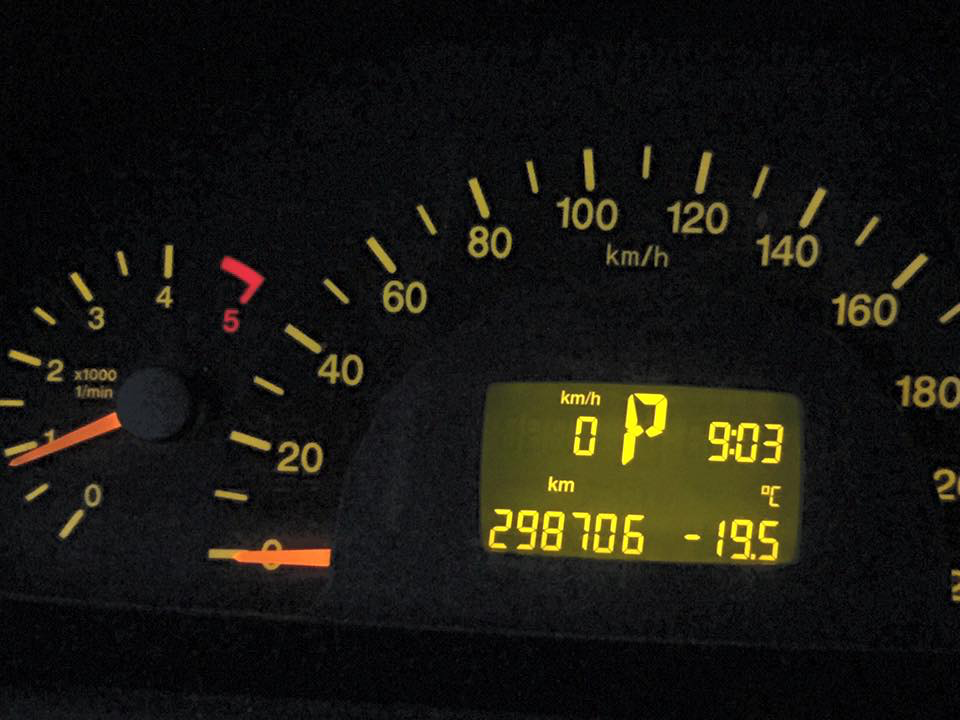
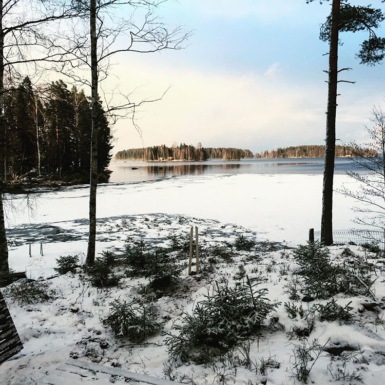
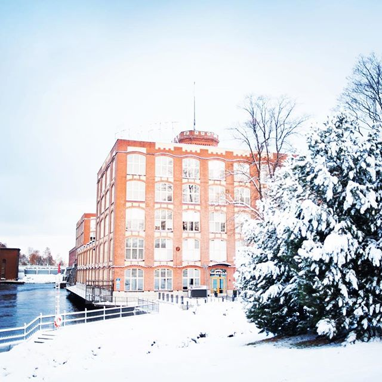
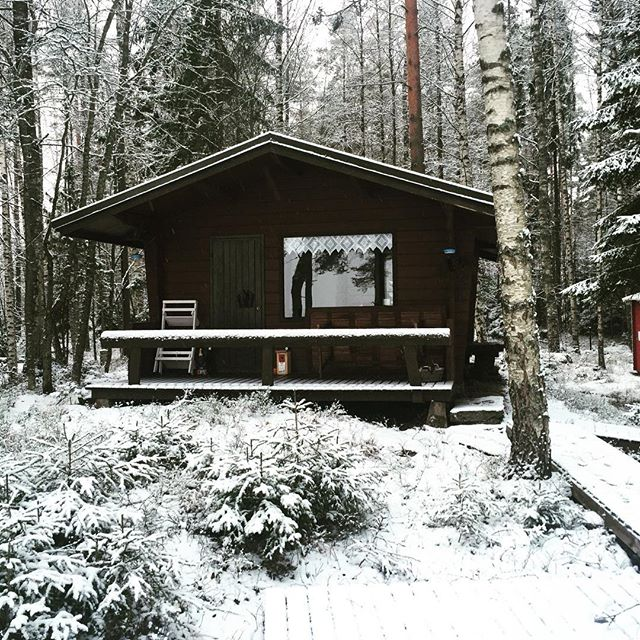
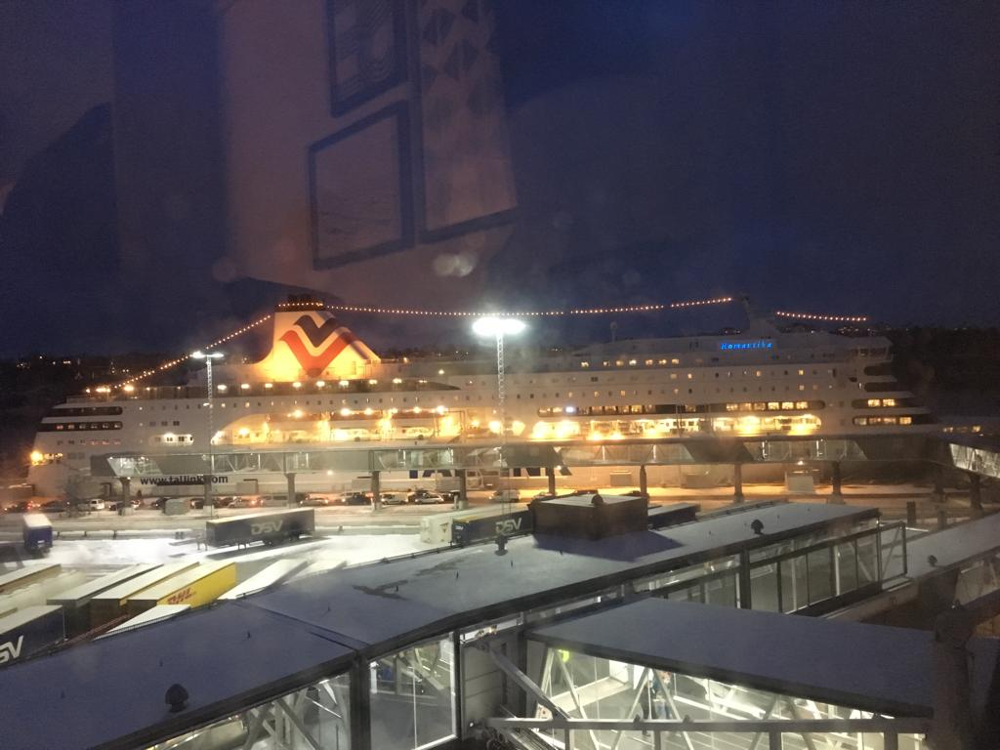
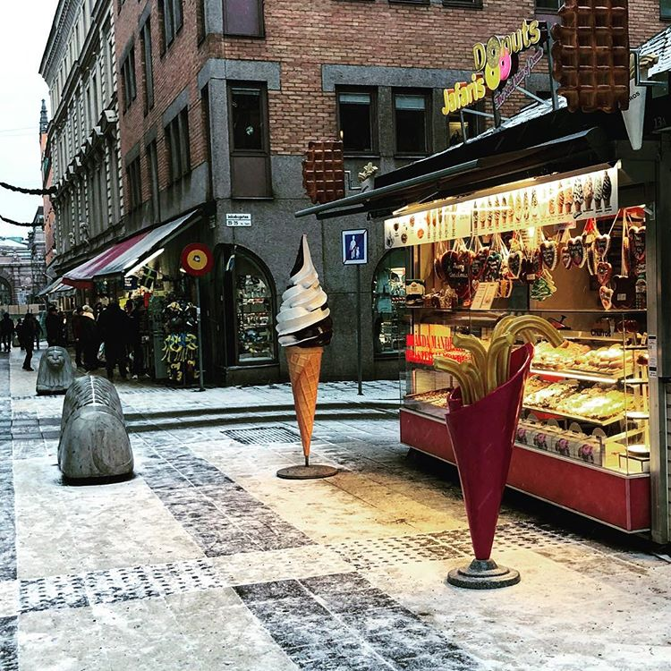
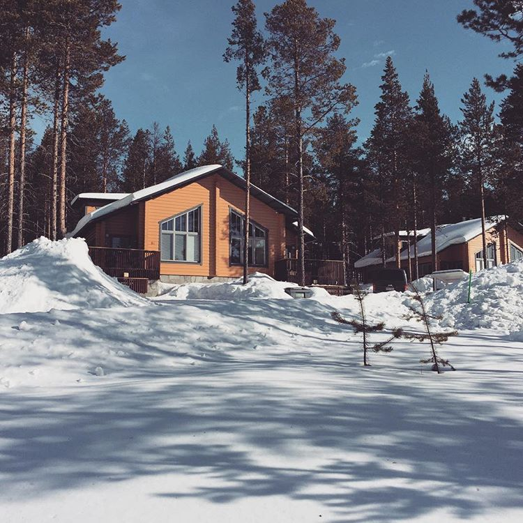
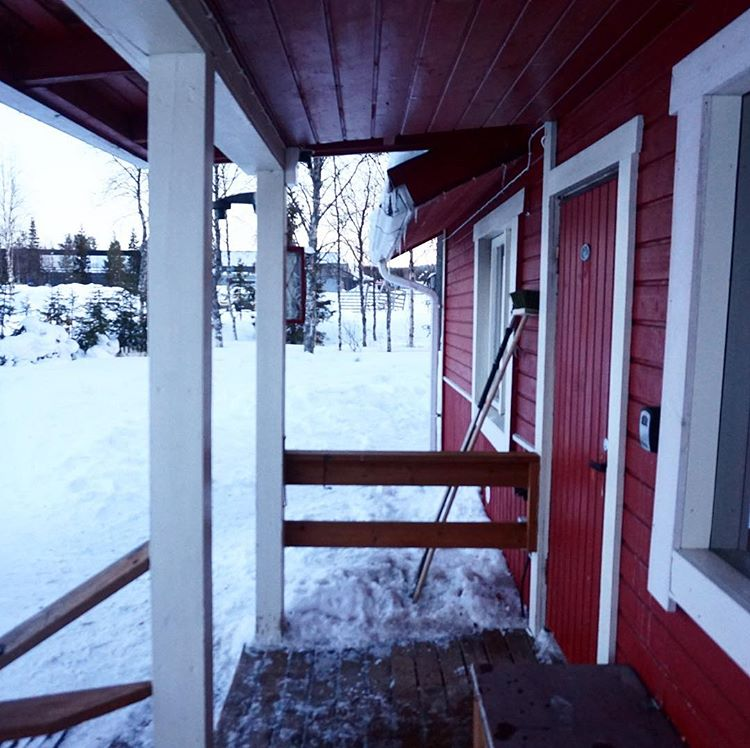

#Mit csináljuk egy finn tél alatt? 

Finnországgal kacsolatban jó sok sztereotípia él az emberekben, amik közül talán nem az összes, de sok valóban igaz is. 

Az egyik ilyen, hogy Finnországban hideg van. Nagyon. Ráadásul 4-5 hónapig tart a tél, ami ugye jóval több, mint 1-2 hét, így komoly felkészülést igényel, a lehető legtöbb szempontból. Nem csak fizikailag kell felkészülni a finn télre, meleg ruhákkal, szöges télugimuval az autóra, hanem kifogyhatatlan mennyiségű hobbival, ötlettel, és tervekkel, hiszen október közepén elmegy a nap, és május közepéig kettőnél több alkalommal nem is fogunk találkozni vele, ami nagyon sok ember számára igazán megterhelő tud lenni, ha nem foglalja el magát hasznos, és értékes tennivalókkal. 

## Kirándulás 

A fenti hideggel kapcsolatos beveztővel éles konktrasztban állhat a kirándulás, azonban a finnországi természet télen, olyankor is gyönyörű, amikor a hőmérséklet alulról súrolja a -20 C-fokot. 

Nem szabad megijedni a hidegtől, jól fel kell öltözni, és kihasználva az ország adottságait, az erdőket, és a (befagyott) tavakat, egy-egy délelőttös kirándulásos programokat bármikor lehet szervezni. 

Termoszban viszünk magunkkal teát, esetleg néhány kolbászt, ugyanis a legtöbb kirándulós hely az erdőben fával, és sütögetővel fel van szerelve, amiket szabadon használhatnak az arra tévedő természetjárók. 

## Szauna 

Mint haogy azt bizonyára mindenki tudja, hogy Finnország a szaunázás paradicsoma. Körülbelől, az 5 millió lakosra 3 millió szauna jut az országban, ami igen szép szám, így rém egyszerű találni nyilvános szaunát, de egyébként a legtöbb lakásnak is alapfelszereltsége. 

De a nyilvános szaunáknak is megvan a maga, varázslatos hangulata, amiket mindenképpen érdemes kipróbálni, és annak, akinek az ilyesfajta kikapcsolódás tetszik, rendszeresen látogatnia. 

Aztán ne felejtsük el az ún `Avantouinti`-t sem, ami nem más, mint a lékúszás. Különösen frissítő, és felüdülést nyújtó élmény egy kellemes téli szaunázás után. 

## Hajóút

Finnország, és Helsinki szerencsés földrajzi viszonykkal rendelkezik, hiszen kikötőjéből napi szinten indulna hajók Tallinba, Stockholmba, Rigába, amik remek hétvégi programok a kikapcsolódásra, és a jegyárak is relatív olcsók. 

Egy hétvégi stockholmi hajóút nagyjából 6 óra stokcholmi időtöltést jelent, ami pont elég egy kis sétára, múzeumra, és egy ebédre valahol a belvárosban, míg maga a hajóút 2x 14 óra körülbelől, de magán a hajón is sok mindennel el lehet ütni az időt. 

Tallin esetében hasonló a helyzet, oda is érdemes 1-2 éjszakára menni, a tallini óváros az év minden szakaszában – így télen is – gyönyörű, és valamilyen kúltúrális, vagy könnyűzenei programot mindig találni.

##Lappföld 

Lappföld, és annak északabbi részei, az északki sarkkörtől még 250 km-re északra található természet a világ egyik talán az ember által legkevésbé érintett területe. 

Ide mindenképp érdemes ellátogatni, és eltölteni egy-egy hetet ezen a gyönyörű vidéken. Természetesen az igazi élményt a téli időszak nyújta, amikor több méter hó borítja a tájat. 

Nem csak a téli sportok kedvelőinek lehet ez jó kikapcsolódás, és időtöltés, hiszen nekem sem sikerült mamgamévá tennem ezeket soha, azonban tény, hogy pl. Levi közkedvelt célállomás a sí, és “cross-country-ski”, snowboard kedvelőinek. 

Azonban a hozzám hasonlóaknak sem kell csüggednie, hiszen a husky hószános szafarik, a motorosszánozás a hegyoldalban, és a rengeteg kirándulóhely számomra több értéket hordoznak, mint a téli sportok. 

Néhány dologot azonban érdemes észben tartani ha valaki Lappföldre szeretne látogatni; 

A távolságok hatalmasak, a bérelhető faházak, kunyhók pedig sokszor igen messze vannak a településektől, így esetenként a civilizációtól is, ezért autó nélkül szinte lehetetlen az élet arrafelé. Nyilván ha valaki valamelyik felkapottabb, turisták által látogatott város központjában, egy szállodában száll meg, talán ez kivitelezhető, nade ki szeretne Lappföldön egy település kellős közepén, a természettől elzárva megszállni, nemigaz? 
Aki viszont nem szeretné levezetni a közel 1100km-es távolságot (mondjuk Helsinkitől számolva), annak sem kell csüggednie, hiszen mehetünk hálókocsis vonattal, amire felpakolhatjuk az autót is, és egy kidós alvás után, Kiittilä-ból a saját autónkkal folytathatjuk az utunkat a célunk felé. 

A másik pedig a szállásunk lefoglalása. Sajnos könnyedén előfordulhat, hogy akár egy, vagy több évre előre kell gondolkozni, különben nehéz helyzetben találjuk magunkat. 

Bármivel is töltjük a Finn telet, töltsünk minél több időt a szabadban, mert a hónapokig tartó sötétség bizony megviseli az ember szervezetét. 