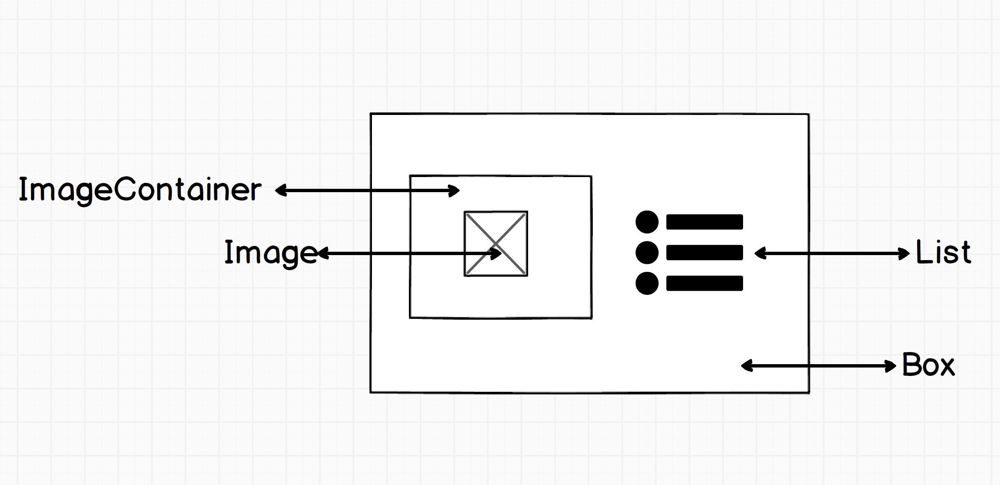

## How to write efficient CSS?

As a fullstack developer, I do often write `CSS`, and sadly more often see badly thought designed and implemented `CSS` codes.

The lack of using any [`preprocessors`]() is one thing, but the general problem is way multifarious. The reason I decided to come up with this article is to help developers create more organized, scalable and better `CSS`

### Use SASS

Despite there are other well known preprocessors out there, I found SASS is the best among them, but this is personal preferences really. I like using the `$` to assing variables, while I found a bit weird do the same by `@` in LESS. This is a tiny difference indeed, but this continues throughout the whole language of SASS, I've simply found it more consistent. But then again, this is a personal preference. 
1.
Using sass, has many advantages, besides functions, variables. It also automaticall does autoprefixing, so you don't have to bother with `webkit`, `moz` and others anymore: 

```
button {
  -webkit-border-radius: 1em;
  border-radius: 1em;
}
```

###Usage of classes and ids 

If you are developing a react application, you most likely won't need ids, therefore just to reference them in `css`, you don't need them at all. Instead try to build your `DOM` structure in a more organized way, that will help you write better partials for your application. The same applies in my personal preferences for classnames. Let's see an example: 



On the wireframe above, there's a set of elements: 

1) a container
2) a container element for the image 
3) the image itself 
4) a list 

The `HTML` structure for this could look like as the following: 

```
<div id="main">
    <div className="image-container">
        
    </div>
    <ul className="list">
        <li className="list-element">
            <a className="link" href="/some/link">
                some link
            </a>
        </li>
    </ul>
</div>
```

Let's add some `css` to the `dom` structure defined above: 

```
#main-wrapper {
  display: grid;
  grid-template-columns: 2fr 2fr;
  align-items: center;
  justify-content: center;
  margin: 0 auto;

  .image-container {
    display: flex;
    align-items: center;
    margin: 0 auto;
    width: 300px;
    .img {
      max-width: 100%;
    }
  }
  .list {
    .list-element {
      link {
        //
      }
    }
  }
}

```

Yes, I have used classes everywhere, even if nowhere really needed to, so let's refactor this a bit: 

```
.App {
  & > div {
    display: grid;
    grid-template-columns: 2fr 2fr;
    align-items: center;
    justify-content: center;
    margin: 0 auto;
    div {
      &:first-of-type {
        display: flex;
        align-items: center;
        margin: 0 auto;
        width: 300px;
        img {
          max-width: 100%;
        }
      }
      & + ul {
        li {
          a {
            color: #ff0000;
          }
        }
      }
    }
  }
}
```

Got rid of the `css selectors`, wrapped the whole structure inside an `.App` selector, which comes by default in React (if you are using `create-react-app` as a boilerplate). 

This `SASS` code is way cleaner, and there's no unnecessary `class` and `id` selectors, still, the result is the same. When using any nested `html` tag, just use its name as a selector. 
Don't listen those who says avoid using `html` elements as selectors. 

###Don't forget about the patterns 

Using the pattern based selectors, such as ` > `, ` & `, and others, are your friend, not your enemy. During the prevous years working either as a freelancer or an employee, people was terrified of these, so they just introduced new and new classes every time, they extended there code, which made result in classnames as: 

* list
– listelement
- current-list-element
- main-list
- ordered-list-item
- item

and so on. 

This can be made way simpler, if yor are referencing these items based on their sorrunding `dom` items, using the advantages provided by the pattern based selectors. 

###Don't repeat code

This applies to any other programming languages also, therefore to `CSS` also. The CTA buttons most likely going to look and behave the same. So it's useless to write the same `:hover`, `:focus` and other `pseudo-classes` a trillion times, which not just a lot of typing, but also increases the possibility of making mistakes. Let's call `mixins` for help: 

```
@mixin ctaHover(color, [...]) {
    :hover {
        cursor: pointer;
        color: $color;
        tect-decoration: underline
    }
}
```

And from now on, you can just include this, wherever you need to: 

```
button { 
    @include ctaHover(red)
}
```

Though, besides `mixins` there are other great functions you should consider using. Let's take a look at `functions`, such as `each`, which you can use to loop through lists, if needed. 

Let's take this example: 

```
$employees: employee1 employee2 employee3

=employee-images
  @each $employee in $employees
    .photo-#{$employee}
      background: image-url("team/#{$employee}.png") no-repeat

.employee-bio
  +author-images
```

This fairly simple function will emits this `CSS`: 

```
.employee-bio .photo-employee1 {
  background: url('/images/avatars/employee1.png') no-repeat;
}
.employee-bio .photo-employee2 {
  background: url('/images/avatars/employee2.png') no-repeat;
}
.employee-bio .photo-employee3 {
  background: url('/images/avatars/employee3.png') no-repeat;
}
```

### Forget about important and other black magic

The most common thing I've come across with, is the extreme usage of `!important`. 
If you are a developer, each time you are using `!important`, somewhere in the world you make a little kitten just as sad as this one. 
We don't want little kittens to be sad do we? 


So *pretty please* do not use this, becasue if you feel like you _must_ 
go forward with `!important` then most likely you've messed up something
in your `CSS`, or you haven't designed the codebase well enough. Go back and fix it without making sad anyone. 

And if we are already at this point, the same applies to `magic values`. I consider every value as magic number, if it's not a multuple of `5`. 
What do I mean? 

These: 

```
p {
    position: realtive;
    left: 129px;
    font-size: 0.9987em;
}
```

These are problematic in many way, but the biggest is that they do not convey the _intention_, aka what the developer (or the designer) wanted to achieve with these values? 
You may ask then, what to do instead? Well, use mathematics, and variables, and also, please, comment the value why it's there. 

Example: 

```
p {
    position: realtive;
    left: calc(100%/2 - ($width/2))
    font-size: 0.75rem;
}
```

Well, looks way better, isn't it? 

### px units are not your friends

Try to avoid using px everywhere in your code, simply becasue they do not scale well. Try to minimalize its usage to border sizes, and basically that's it. 
Instead, use `em`, `rem` `vh` and `vw`. First two scales with the `font-size` while last two slaces with the `resolution`. You decide which one goes better for the problem you want to solve. 

Also, avoid using `floats`. They are deprecated for years by now. 

### What should you understand? 

The basics will help you produce higher quality `CSS` the rest is just sugar. 

1) [`selectors`](https://developer.mozilla.org/en-US/docs/Web/CSS/Reference#Selectors), as I've stated above. 
2) [`box-model`](https://developer.mozilla.org/en-US/docs/Learn/CSS/Styling_boxes/Box_model_recap), `box-sizing`, etc. 

