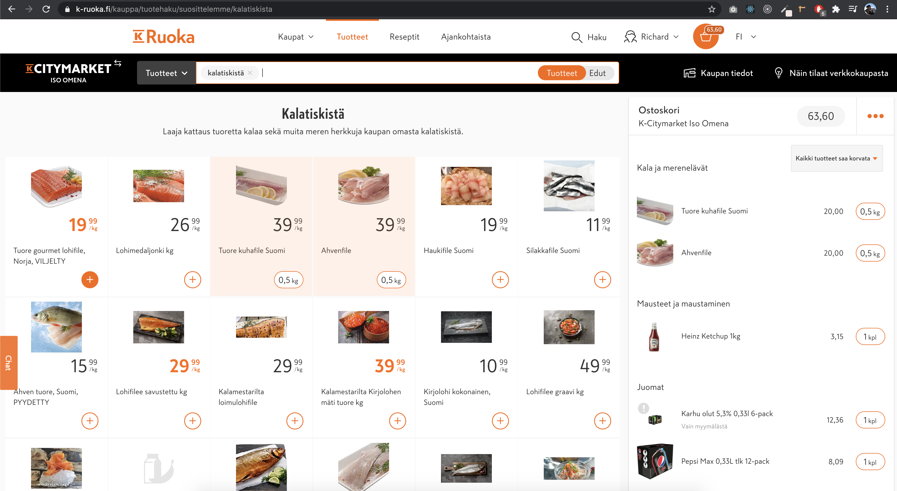
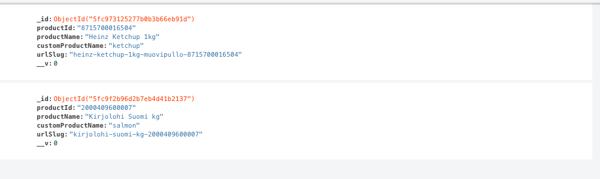

In the previous post I have described about the beginning of my journey with my smarthome.
In this post I'll take a step further, and I will walk you through, how I automated ordering groceris from the finnish [k-ruoka](https://www.k-ruoka.fi) online store.


K-Citymarket is just like any other only grocery shop. You can browse withing stores, products, place an order, and get them by home delivery. It's not just like that, it works exactly like any other webshop.
In the previous blogpost in my `smarthome` series, I have been talking about Google's home assistant. Just like in that one, this will inlucde `Google Assitant` too!

## The problem

Managing shoppping lists was also hard for me, for several reasons, but mostly, I either forgot to add items to it, or forgot to take the list with me, or if the list was on my phone, I simply forgot to check it, so I always ended back at home with something missing.
So i wanted to automate the process. Google Assistant can handle lists, but I saw zero difference, by Google adding the products, or me writing it in a note on my phone. The end result would not have changed: _me forgetting something_.

So I came up with the idea, let's automate the entire process. Let's have Google adding lists to my custom shopping list, and also, when I tell him to, place the order, send the email notification, and get it in motion, which will end with getting the prdducts ordered straight from `K-Ruoka`.

## The beginning

First thing first, I needed to figure out whether `K-Ruoka` has an open API, to handle all these things, I wanted to automate. Not suprisingly, they didn't have. I even contacted them on Twitter, they promised to get back to me, but they eventually never did.

So there was nothing else here really to do, but to figure out how does their online shop works, by `reverse engineering` and hoping for the best, that there are something I can use to go forward.

And guess what? *There was*.

## The idea

So, let's see the basics, from the very beginning, what I want to achieve here: 

1) send commands to Google assistant, to add specific products to my shopping list
2) place orders
3) get confirmation

## Researching

This sounds pretty simple, so first I needed to figure out how `K-Ruoka` handles it's product. This is a pretty basic method of `reverse engineering`, I just opened their website, and started browsing items, and added them to the basket.

Simply collecting items, and adding them to the basket, by pressing the `+` sign.



And, of course, while doing this, I needed to observe the debugger's network tab in the browser, to see what kind of requests the frontend sends to their backend, if there's any.

It was pretty easy to spot out, after pressing the `+` button that the frontend actually sends some requests to the backend.


So I have started investigating this request. By going further, and checking the actual `URL` there's a few things we can understand immediately:

So this is a `PUT` request, and the `URL` looks like the following:

```
https://www.k-ruoka.fi/kr-api/order-drafts/
138e6952-25b3-4242-9851-8f229535f47b/
update?storeId=N106&clientUpdatedPSD2=1
```

Let's take a closer look what we have here, which seems to be important:

```order-drafs```

This definitely handles our basket.

`138e6952-25b3-4242-9851-8f229535f47b`

This must be our basket id, which looks like a `uuid`.

`update`, means we are updating our basket.

`storeId=N106` our chosen store, for example `Espoo, Iso Omena`

Well, this looks pretty easy, let's save it for later, but it seems I am able to pragmatically add products to my basket.

Let's observe now the payload of this request:


Well this is pretty straightforward, this is an `Array` of products.

So what I need to do here agin?

> Being able to add procuts, to a basket, pragmatically, (by calling some _custom_ API)

## Implementation

To figure out how to do this, i needed to figure out how to get a `productId`, of a product, I want to add.

This is again, just some very basics of `reverse engineering`. I did the same thing again, started to use their own search, to look for different products, and observe the requests.


I just permormed a simple search, looking for _suklaa_ (🇬🇧 chocolate),

and observing the `network` tab:


And as I expected, there's some request to the backend, which handles the search request.

Let's see also it's playload:


The usual stuff, including the `storeId`, which is important in our case.

Let's see it's response:


Woahh! This looks like something we actually needs.


This is how one product's object looks like. We can also obtain the `ID` of the product, as well as localized names, which well be especially important for us, since I want to tell the product name to `Google Assistant` to add it to the shopping list.

Turns out, the localized names are not just the _names_ it also includes quantity, and some _types_ so at this part, to proeed, I needed to think a bit:

```
english: "Fazer dark chocolate 200g"
finnish: "Fazer Tumma suklaa suklaalevy 200g"
swedish: "Fazer mörkchoklad 200g dark choco"
```

Of course, I don't want to say something like:

> Hey Google, add _1 Fazer dark chocolate 200g to my shopping list

First of all, who remembers that, and I had some concerns Google will actually understand that, yet alone, find it's productId, even with the `API.

Then my thinking went back to the original prolem. I want to automate the grocery shopping. We are usually buying the same stuff:

1) bread
2) eggs
3) drinks
4) vegetables
5) ketchup, mustard, etc
6) ...

So, here I needed to come up with something, to make the process easier. I want to buy _ketchup_. We have the brand chosen, so it's just ketchup, and not: _Felix Ketchup ilman lisättyä sokeria 970g_

So eventually, I came up with a middlware solution:

- store the products in a self-owned database
- store the shopping lists in a self-owned database

Where I can add `K-Ruoka` products, with their own ID, and some `customName` what will be easier to understand by the `Google Assistant`.

So I have created a server, using `nodeJS` and `express`, implemented a wrapper aroound their official search `API`, created a schema for storing products: 

```
const productSchema = new Schema({
  productId: String,
  productName: String,
  customProductName: String,
})
```

Everything is super self explanatory, the `productId` is their own Id, that represents a product, the `productName` is the localized name of the product, and the `customProductName` is who I will refer to this specific product.

The idea was the following:

>Hey Google, I want to buy ketchnp!

Where Google calls an API, passes the spoken argument, which is the `customProductName` (_ketchup_), finds the `K-Ruoka` `productId`, and adds it to my custom shopping list, which by the way has the following `Schema`:

```
const shoppingListSchema = new Schema({
  createdAt: String,
  isFullFilled: Boolean,
  id: String,
  items: [{
    type: mongoose.Schema.Types.ObjectId,
    ref: 'Product'
  }]
})
``` 

To make my, and Google's life eaier, I will always have *1* open shopping list, and I control that with a simple `Boolean`, on the `isFullFilled` property. I have a guard in my own `API` which will return `500` if there's no open shoppping list, saying, I need to create one first. This is just my own preferneces, really, either I need to delete an open shopping list, of place the order, so I am not gonna get all messed up, with different shopping lists.

```
ShoppingModel.getLastUnFullfilledShoppingListId()
    .then(result => {
      if (result === null) {
        const unFullFilled = {
          isSuccess: false,
          reason: 'No shopping list found, you need to create one first'
        }
        res.status(500).send(unFullFilled)
        ...
```

Of course, to achieve all this, I needed to have some UI, where I can search for `K-Ruoka` products, and add them with my `customName` to my own database.

## Custom UI


For the search `API`, I have creaed a wrapper function again, using `axios`, which cancallable requests, so I can type and wait for the response:

```
export const makeRequestCreator = (): any => {
  let source: any;
  return (apiEndpoint: string, params: any) => {
    if (source) {
      source.cancel();
    }
    source = axios.CancelToken.source();
    return new Promise((resolve, reject) => {
      axios(apiEndpoint, {
        method: "POST",
        cancelToken: source.token,
        data: params,
      })
        .then((response) => resolve(response.data))
        .catch((error) => reject(error));
    });
  };
};
```

Now I have the same results as I were searcing on the `K-Ruoka` website. I have the product object, including the `ID`, the localized `productName`, and so on. Need to add the item with the desired `customName`:


It's a super simple UI ,but does the job. When I hit the `Add this product` button, this `K-Ruoka` product goes into my own `mongodb` database.


Now, there's the next step. Create the `API` that will be called by Google, with the desired `customProductName`, and adds it to our custom `productList`.

This part was actually simple. Just needed to create a custom `Google Asssistant` service, that listens to a specific command, and call's some `API` with some payload.

>Hey Google, add # to my shopping list.

Where `#` is the item, I wish ot add.

Turns out, even though this supposed to be simple, it's impossible to mke Google forget it's own _lists_. So, I was not able took any webhook request, the the sentence _add, product, shopping, list, grocery_, etc. By not being able to hijack the builtin in list handling, I just ended up some lists in my Google account, named `shopping lits`, with items, on it like:

1) ketchup
2) bread
3) egg
4) ...

Well, this is definitely nbot what I want to achieve here, so I just needed to come up with an expression, Google doesn't try to iterpret as it's own list handling commands.

After trying out a bunch, I actually ended up with: 

> Hé, Googlee! I need to buy #

Need to buy sounds a bit low-level english, but I guess it will do the job, simply, easy to remember, relatively correct, becasue if I am using this command, that menas I actually _need to buy_ that item in question.

## IFTTT

So by being able to say something to the `Google Assistant`, that doesn't want to do anything with my lists added to my Google account, I could continue, with figurig out, how to make `Google Assistant` to make an `API` call, once they processed. After a few searches in Google, Turns out there's a few approaches out there, including using Google Assistant's `SDK`, `Raspberry PI`, etc. These all seeemed pretty complicated to me, just to build an other serivce, that can call an other service.

Nah, there has to be something else. And there was! I found [IFTTT](https://ifttt.com/), which provides a bunch of extremely handy processes.

_IFTTT_ stands for: _If This Then That_, and it's as easy as it sounds. You can create some logic, by chaining commands together, publish it and then you are ready to use immediately.

This is the simple worklow I created in a service using `IFTTT`:


## So where are we now?

1) I am able to search withing `K-Ruoka` products, and them with a `customName` property, into my own `mongoDB`.
2) I am able to tell `Google Assistant` what I need to buy and to call an `API`, with that specific item.
3) I have the desired product in my `mongoDB` in a `shoppingList` schema, where the `items` are stored in an `Array`.

The database of the `shoppingList` at the moment looks like the following:


We have an `id` that identifies the shopping list itself, and the array with the product. Right now, there are `2` different items in the list, both referenced by their `ObjectID` from my own `Products` collection.



## Let's get back to the basketID

I have mentioend it ealier, that if I add some product on `K-Ruoka`'s frontend, there's a `PUT` request sent to the backend, with the item, and with a `uuid` of a `basket`.

Once again, the `buskedId` looked like the following:

`138e6952-25b3-4242-9851-8f229535f47b`

By first blink, this looks like an `uuid`.

At this point I needed to figure out how can I add to a basket without using their frontend. So, by simply generating my own `uuid`, using for exampe the [`uuid`](https://www.npmjs.com/package/uuid) npm package.

After generaint an `uuid` I was calling their `draft` `API` with a copied payload from the request:

`uuid: b0d2eb8c-9408-4638-a1d8-788f7b7e3b3c`

payload:

```
[
    {
    "type":"ITEM",
    "id":"6407800009938",
    "ean":"6407800009938",
    "amountInfo":{"amount":2,"unit":"kpl"},
    "allowSubstitutes":true
    }
]
```

And the response was the following:

```
{
    "message": "Draft was gone before updating"
}
```


Well, that's a problem. Seems like, they are creating, and then validating these `buskedId`s, on their own way. I needed to figure out where, and how this specific pieice of string is created, that represents a basket.

By opening an inconito window, with the console, then opening `k-ruoka.fi`, I was not able to catch any request, that creates and returns this.

For a while there was no success at all, but it has to come from somewhere, since it's part of the request, and it made me think, its not part of some middleware on the backend.

And _then_, I found this:


It returns an `HTML`, but it seems like they are storgint the entire applicatino state in a `div`'s `data-state` attribute. Weird solution, but luckily, this is exactly what I need.

So I just needed a `node-html-parser` call this `endpoint`, get the `data-state` attribute, parse it into `JSON` and get the `draftId` property. Simple as that: 

```
exports.createbasket = () => new Promise((resolve, reject) => {
  fetch(`${kRuokaApi.createbasket}`, {
    method: 'GET',
    headers: {'Content-Type': 'text/html'},
  }).then(html => html.text()).then(htmlResponse => {
    const html = parse(htmlResponse)
    const applicationState = html.querySelector('#applicationState').getAttribute('data-state')
    resolve({
      isSuccess: true,
      basketId: JSON.parse(applicationState).page.state.orderDraft.draft.draftId,
    })
  })
})
```

I wrapped it into an endpoint in my own `nodeJS` server, and now, by calling that, voilá:

```
{
    "isSuccess": true,
    "basketId": "78cd610f-2867-468c-a592-806c5c68a86b"
}
```

I have a `buskedId`. I changed the terminology from `draft` to `basket` that's more straightforward for me.

And now, by using this `basketId`, i am able to add items pragmatically using the itesm stored in my own `shoppingList` collection:


And while this is great, there's some things to keep in mind.

For example we don't know how long these `basketId`s are valid, also we don't know what type of validation they run against the items being inserted to the basket. So instead of keep adding items to the basket, let's create it and add all the items being placed in my own `shoppingList` when I am ready to place the order.

And thats should be fairly easy, since we have now everything: 

1) the `Products` in the shopping list, which has their `K-Ruoka` `productId` as reference,
2) I can create new basket,
3) and I have an `API` that returns everything about a product.

This last, 3rd point needs some explanation.

## Dealing with products

 noticed, when I am clicking on a specific prouct on their website, there's a request:


And this returns every piece of data, that represents a `Product`:


It's safe to assume I will need all these, when placing the order, since it's also part of the object the frontend sends to the backend, when adding an item to the basket.

I don't want to store this in my own database, for 2 reasons:

1) useless for my purposes
2) what if some of the properties has changed between the time I have added to my basket, and the time my order is being placed.

To avoid that, I will create the basket, and add all the items the moment I tell my google assistant, to place the order.

So in my `MongoDB` there is an `Array` of `items`, where the some of the details are present.

Again:

```
const productSchema = new Schema({
  productId: String,
  productName: String,
  customProductName: String,
})
```

So, to get details of a product using `K-Ruoka` `API`, I need a property called `urlSlug`. It was present in the result when I was searching for a specific item, using their own search `API`.


I thought, I will save this into my `Product` alongside with the `productId` and the `customProductName` that I am assignignt to every product.

```
const productSchema = new Schema({
  productId: String,
  productName: String,
  customProductName: String,
  urlSchema: String
})
```

So by using the `urlSchema` property, I can get every item's data, when creating the `payload` for the order itsself.
I just need to loop through the `items` `Array` in my `shoppinglist`, and call the `API` mentioned above, with the `urlSlug`:

```
exports.getKRuokaProductByUrlSlug = productsArray
  => new Promise((resolve) => {
  const promiseArray = []
  const resultArray = []
  for (let i = 0; i<productsArray.length; i++) {
    promiseArray.push(new Promise((resolve) => {
      fetch(
        `${kRuokaApi.getProductByUrlSlug}/
        ${productsArray[i].urlSlug}-n106
        ?storeId=N106&languageId=fi`
      )
      .then(productResponse => productResponse.json()).then(
        json => {
        resultArray.push(json)
        resolve(resultArray)
      })
    }))
  }
  Promise.all(promiseArray).then((result) => {
    resolve({
      isSuccess: true,
      result: result[0],
    })
  })
})
```

I am creating a `Promise` in every iteration, making sure every request returns the data, and then resolving them all with the `resultArray` when every `Promise` had been fullfilled.

This is how the shopping list looks like at the moment:


It has 2 different items, so I need to call their `API` 3 times, with the 3 `urlSlug` to get the following `resultArray`:


There, there are 2 objects in the array. I kept them closed, as there are a lot of stuff in them, and we saw previously how does one response of tha request looks like.

There's not much left to do, just to create a valid payload of placing an order. There's really not any other way to `reverse engineer` this, except the most obviosus one: I needed to order things, in order to figure out how does it works.

This wasn't a piece of cake, so let's get into it.

### End of Part I

This is not the end of the journey of automating the groceries. I stillll need to palce the order with the very minimum interaction needed from me. If you are interesting, check back here every now and then, or follow me on [https://twitter.com/zilahy](twitter)