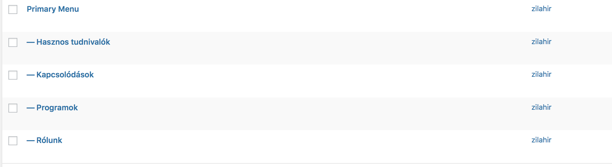
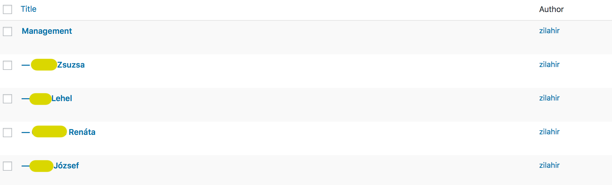

FME is stands for `Finnországi Magyarok Egyesülete`, (`Association of Hungarians in Finland` // `Suomen Unkarilaisten Yhdistys`), and I was just elected as a board member in the beginning of this year.

Since I am a fullstack developer, I immediately assigned myself to recreate the entire website of the association from scratch. 

There were no actual deadline set, so I had plenty of time both designing, and making the decision about the stack related questions, and also the implementation itself. Which came quite handy, since I am the only developer among us, so I was not able to outsource any task, it was all me.

Which fact, actually led from one decision to an other, especially when it came to make decision about the architecture itself.

I was confident going with ReactJs on the frontend, using GatsbyJs to avoid taking care of the server side stuff too much. Since Gatsby’s biggest advantage is the way it deals with the data using `GraphQL`, the second decision was also quite straightforward. I need a CMS. 

Since I planned the redesign and complete rewrite in a way to avoid the content on the website will be managed by one person only, too complicated CMS was not really possible, so to make it as simple as possible, and despite my contempt towards standalone Wordpress instances,  I’ve made my decision. 

Having a Wordpress based website can be a real pain in the ass, with all those purely written plugins, the deprecated php functions, the limitations of the mysql, and so on, I decided that only 2 major part I will use in this project, which is provided by Wordpress: 

1) The RESTful `API`, 

which is finally, in 2019, managed to reach a level of version when it’s actually useful, (few limitations still, but oh well, we will go around those just in a bit): 

2) The content editor 

It would be a shame to take Wordpress’ merit on this, but the content management system, writing the posts, handling it tags, categories, attaching media and featured image is relatively good, there’s no need to come up any better than that at this stage. 

There is one big problem still where I needed to take different approaches into consideration; having a self hosted instance of Wordpress installed somewhere, which then needs a mysql database, and in general, I will need to maintain it in the future. And THIS is something I really-really wanted to avoid. I neither have the time, or the motivation to manage and maintain a Wordpress instance just because it’s `API`, and the graphical content management part. 

So, here comes wordpress.com handy, which provides you a self, fresh Wordpress instance, under some Wordpress domain, but it’s the same basically as you’d host on your own VPS. 

Let’s rock, register, login, and then the first surprise hits me. The free plan does not includes option to install plugins. Don’t get me wrong, me personally completely against every single plugin, since those are just messing up the DOM structure, inserting useless, and huge JS and CSS files, making the website unusable, so thanks, no, I am not a Wordpress plugin wizard, instead, I suggest still every developer, who have the honour to deal with Wordpress, to dump all the plugins, and implement the feature needed by yourself. 

Except one: `ACF`. I still do not understand why guys, members of the Wordpress foundation, and working on it as it’s open source terms, bothering with this all Gutenberg hype, instead of MAKING `ACF` DEFAULT OF WORDPRESS?

Anyways, using free wordpress.com plan does not allow to have even a single plugin installed, so at this point I needed to decide whether I will give up my principle which states no more nightmares dealing with self hosted Wordpress instances, and just take all those tasks which are comes alongside with this decision, or pay for the plan one above the free, or, find a different approach. 

I am sorry guys at wordpress.com but no, paying for having the possibility to install a plugin which is not a free one itself either, plus considering the fact the functionality that plugin provides should be part of the very basic Wordpress out of the box, I’ve decided I will just to go around the problem. 
What custom fields I’d need? 

Since the content on the website are events, report of events, articles, and some other stuff which are very similar to these.

What we have from a published Wordpress post? 
We have title, category, tags, and … yes, we have excerpt, which me personally always found useless, but this time, I was extremely grateful for it. 
 
Why? 

Because, I can put `JSON` object there, and the process that as a data on the front end, like: 

```
{
  "location": 'Karjaa’, 
  “date”: “2019-01-01, 
  [ … ]
}
```

So, with this silly approach, I’ve managed to get rid of the `ACF`. It’s not really helping, that Wordpress storing this excerpt as HTML formatted text, and turns the ` " ` into `html` chars, but oh well, this is something I can easy get around with a regex, and just note the limitations. I can live with that. 

##Creating the menu structure

Unfortunately wordpress.com does not provide `API` endpoint to get the menu structure built within the Wordpress admin. So, needed to find some workaround there also.

And here coms an other feature of Wordpress which I basically never used before: setting the parent of a page. 



So I created a page, named “Menu”, left it all Empty, got it’s genereated `id`, and then, created all the subpages, set their parent to `Menu` and they are representing the menu, as a structure. 

From this point, only thing I needed to do, is set up a `graphQL` query, filter the wordpress pages to retrieve all pages which has their parent with that specific id, and voila, menu structure is ready, and provided by a really simple `GraphQL` query. 

Of course, at this point I had to introduce the first helper `javascript object`, which suppose to contain all the page’s id’s of the menu, so the `gatsbyjs` will now, which page should be rendered if the user clicks on any of them. 

Something like this? 

```export const wordpressIds = {
	testimonials: 548,
	upcomingEvents: 617,
	usefulStuff: 538,
	events: 535,
	aboutUs: 527,
	archive: 530, 
	connections: 540
}
```

These helper objects are really handy, because there are a few things that the Wordpress `API` can’t provide, such  as the full names of the post author. No one really wants to show silly usernames on the post pages, right? 

So, again: 

```
export const users = [
	{ author: 'zilahir', fullName: 'Richard Zilahi' }
];
```

And then, only a `find()` method needed during the `render()` which then returns the `fullName` property of the object, where the `author` is `zilahir`. 

Easy peasy.

And then, I have applied the same type of logic setting the parent elsewhere also, it turned out pretty handy, so I am using it for showing the “upcoming events” for the rest of the year, creating a section for the Management, etc. 



## Conclusion 

So, with a few limitations, I have managed to get rid of a self hosted Wordpress instance, and just a few more, managed to avoid buying paid plan on wordpress.com, by going around the problems, and solving them in a different way. 

Gatsby is a great tool indeed, and using the power of React, Redux, `GraphQL`, even with these limitations, and not-so-powerful Wordpress `API`, I think I’ve managed to solve the problem. 

The new website is up and running, there’s still a million things to do, rewrite, refactor, fix on it, just like with every other webdev project on earth, they will eventually come to and end, and by the time, I can start the whole process from the beginning, since this one probably will be outdated. 

But one thing I’ve learnt, is that using GatsbyJs with React, and `GraphQL` helps the developers to finally get rid of the PHP and Wordpress,and start making better, more scalable, maintainable,  and better User Experience. 

