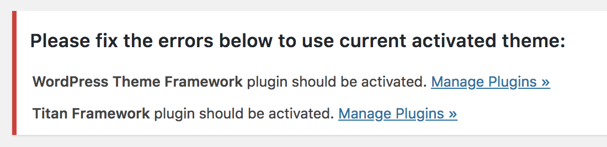
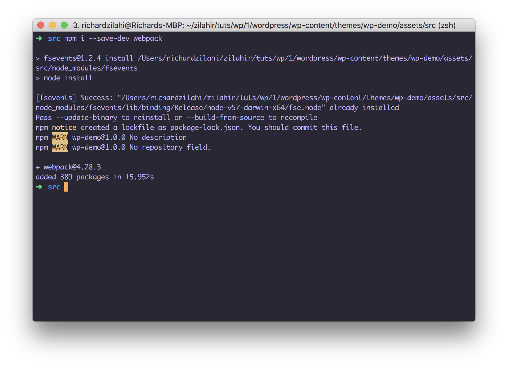

##Hogyan fejlesszünk wordpress szájtot 2019-ben? 

Sajnos nagyon sok internetes közösségben, legyen az egy tematikus wordpress csoport, stackoverflow, vagy hasonló, még mindig azt látni, hogy a wordpress fejlesztés még mindig le van ragadva valahol 2006 környékén.

2006 régen volt, úgyhogy úgy gondoltam, hogy ideje lenne, a magyar wordpress fejlesztői társadalmat egy kicsit terelgetni a modern fejlesztői eszközök irányába. 

Gondolkoztam, hogy mennyire az alapoktól kezdjem, és úgy döntöttem, hogy aki idetéved, azok az alapokon már túlvannak, úgyhogy amolyen bele a közepébe jelleggel fogok haladni. 

Fontos megemlítenem, hogy az itt leírtak az én személyes preferenciáim, ahogyan én szoktam, vagy legalábbis ahogyan az elmúlt 1-2 évben vágtam bele egy-egy egyedi wordpress mini webalkalmazás fejlesztésébe. Mostanában kerülöm a worpress bűvölést, az utóbbi időben eltávolodtam a PHP-től, JS alkalmazásokkal foglalkozom mostanában. 

A teljesség igénye nélkül, a sorozatban olyasmik fognak elhangzani, mint docker, npm, webpack, MVC, SCSS, különböző JS frameworkok mint pl. React, GatsbyJs, terveim között szerepel egy wordpress szájt építése csak a restAPI használatával.

Természetesen használni fogom a git nyújtotta előnyeit, a brancheket. Fogok készíteni normális deployment processt, pipelineokkal, manual, és auto triggerekkel, automatizált SQL dumpolással, ilyesmivel. 

Én (Visual Studio Code-t)[] használok, de mindenki használja azt, amit szeret, és megszokott. 

Egyúttal, nekem is egy jó lehetőség ezek contentek elkészítése közben, hogy kísérletezzek új technológiákkal, úgy meglátjuk mi fog kisülni belőle, úgyhogy,

vágjunk is bele. 

##Docker 

(Docker)[], és (Docker compose)[] installálva, és futnak. 

Csináluk meg a folder struktúrát a projekthez. 


`mkdir wp-demo `
`cd wp-demo `
`touch docker-compose.yml`
`code docker-compose.yml`

Csináltam egy docker-compose fájlt, [ezen](https://gist.github.com/zilahir/2582c1490c54e2d41a1c0754a54ce7d8) a github gisten megtaláljátok. 

Copy paste az imént létrehozott `.yml` fájlba, aztán irány a terminal, és építsük meg a docker containereket. 

`docker-compose up`


Lefutott hiba nélkül, üssük fel a localhostot, és nézzük meg, hogy mi történik. 

Semmi. 


Ennek az oka, az, hogy bár minden docker image le lett töltve, ami benne van a `docker-compose` fájlban, csak épp senki nem konfigolta fel még az nginx webservert, úgyhogy tegyük ezt meg. 

A root folderben létrejöttek mindenféle könyvtárak: 


Állítsuk le a containereket, just in case. Ehhez vagy egy másik terminalban `docker-compose down` vagy simán `CMD+C`. 

Menjünk az `nginx` folderbe, és hozzuk létre az `nginx.conf` fájlt. 

`cd nginx`
`touch nginx.conf`

Illeszük be a már előre elkészített config fájlt. Szintén megtalálható (github gisten)[]. 

Meg is vagyunk, indítsuk újra a containerket.

`docker-compose up`

És most már, ha beütjük a `localhost`-ot a böngészőbe: 

A már ismerős install wizard fog fogadni. Gyorsan lépkedjünk rajta végig, majd jelentekzzünk be adminként. 

Szuper, egy teljesen friss wordpress fut egy docker containerben. 

A következő lépés, hogy felhúzunk egy rendes `dev` environmentet. 

Ehhez jópár dolgot fogunk használni: 

1) [MVC](https://en.wikipedia.org/wiki/Model%E2%80%93view%E2%80%93controller) patterned wordpress theme boilerplate
2) npm
3) webpack 
4) sass
5) és még jópár finomság.

Először is, kezdjük a theme boilerplate-tel. 

Menjünk a wp instance folderjébe, majd a `theme` folderbe. 

`cd wordress/wp-content-themes`.

Én egy általam [forkolt](https://github.com/zilahir/wordpress-theme-framework) verziót használok a justcoded által készített [boilerplateből](https://github.com/justcoded/wordpress-theme-framework). Én ezzel szeretek dolgozni. 

`git clone https://github.com/zilahir/wordpress-theme-framework`


Gyorsan nevezzük is át a clone-ozott mappát. 

`mv wordpress-theme-framework wp-demo-theme`

Menjünk vissza az admin felelütre, és tegyünk rendbe pár dolgot. 

Ahhoz, hogy ez a boilerplate működjön, szükség lesz két pluginre, amiket a `readme` is ír. 

Az egyik a `WordPress Theme Framework`, illetve a `Titan Framework`, de ezekről értesít minket a wordpress is, amit akitálvni szeretnék a theme-t. 



Az utóbbit megtaláljuk a plugin directory-ban, keressük is meg, és telepítsük fel, és aktiváljuk. 

A `WordPress Theme Framework` esetében ismét fel kell ütni a [GitHub](https://github.com/justcoded/wordpress-theme-framework)-ot. 

Menjünk a `wp-content/plugins` folderbe, és cloneozzuk ide a plugint. 

Amint megtörtént, látszódni fog ez a plugin is a listában. 


Menjünk vissza a `Themes` settings oldalra, és aktiváljuk a témát. 


Nézzük meg hogyan néz ki az oldal most. 

Szuper, úgy fest, hogy minden működik, és most pedig tegyünk egy kis rendet. 

Menjünk vissza a `themes` fodlerbe, és töröljük ki a szemetet, a default themek-re nincsen szükség. 


`rm -rf twenty*`


Most pedig jöjjön az igazi setup. 

Nyissuk meg az egész projektet valamilyen IDE-ben. Én Visual Studio Code-ot használok. 


A bal oldali `tree view`-ben keressük meg a `themes/wp-demo/assets/` foldert. Itt látni fogjuk, hogy a boilerplate ígéretéhez híven van már `css`, és `js` fájlok is. 

Ezt most átstrukturáljuk egy picit. Hozzunk létre egy `src` foldert az `assets`-ben. 

Majd mozgassuk át a `js` mappát ide, az `css`-től pedig egy mozdulattal szabaduljunk meg, nem fogunk `css`-t írni. 

A `js` folderben van egy (egyébként üres) `jquery.main.js` fájl. Töröljük bátran. 2019 van, semmi szükségünk `jquery`-re. Majd hozzunk létre egy új `javascript` fájlt, mondjuk `site.js` néven. 

Még mindig maradunk az `assets` folderben. Hozzunk létre egy `dist` foldert, ide fognak jönni a compile-olt fájlok. 

Ideje visszamenni a terminalba. Menjünk a `wp-demo` folderbe: 

`cd wp-content/themes/wp-demo`

Mivel ez egy githubról clone-ozott projekt, töröljük a `.git` foldert, mert majd saját repot fogunk használni. 

`rm -rf .git`


Majd menjünk az `src` folderbe. 

`cd assets/src`


és inicializáljunk egy új npm projektet.

## Npm & Webpack

`npm init`

Mindenféle dolgot érdezni fog, pl. projekt neve, verziószám, owner, git url, stb. Töltsük ki megfelelően, a végén pedig nyugtázzuk egy `yes` paranccsal. 


Jöhet a móka. Egy rakás dolgra szükségünk lesz, úgyhogy kezdjünk el instalálni őket. 

Először is [webpack](https://webpack.js.org/). 

`npm i --save-dev webpack`



Ezután szüksgünk lesz a [`Path`)](https://www.npmjs.com/package/path) névre keresztelt modulra, hogy a `webpack`-kel tudjunk fájlokat pakolgatni ide oda. 

`npm i --save-dev path`.

És akkor a következő lépésben egy nagyobb lélegzetvételű npm install jön,ami minden olyat tartalamz, amire fejlesztés közben szükségünk lesz. 

Pl [babel](https://babeljs.io/), ami egy js compiler, különböző modulok a `SASS` compilerhez, pl.: `node-sass`, `sass-loader`, `css-loader`, `style-loader`, `node-sass`, és [`autoprefixer`](https://www.npmjs.com/package/autoprefixer), ami a `vendor` értékeket adja hozzá a css-hez a [Can I Use](https://caniuse.com/) táblázatai alapján. 

`npm i --save-dev babel-loader babel-loader@7 @babel/core style-loader css-loader sass-loader extract-loader postcss-loader, node-sass, autoprefixer, file-loader, extract-loader, @babel/preset-env`. 

Most pedig hozzunk létre fájlokat a `SASS`-hoz. 

Először is kell egy `scss` folder az `src`-ben. Az `scss`-be pedig három: `partials`, és `mixins`, és `helpers` hogy szépen szét legyenek bontva a stílusaink. 

Az `scss`-be hozzunk létre egy `style.scss` fájlt, és a `helpers` fodlerben egy `variables.scss` fájlt, illetve egy `reset.scss` fájlt. 

A `reset.scss` be rögtön bele is írhatjuk, hogy 

```
* {
    margin: 0;
    padding: 0;
}
```

ezzel resetelve a böngésző defult beállításait. 

Csak teszt jelleggel adjunk egy változót a `variables.scss` fájlba, mondjuk valami piros színt.

```
$demoRed: #b30000;
```

Üssük fel a `style.scss` fájlunkat, és importáljuk be azokat, amik eddig elkészültek: 

```
@import './helpers/reset`
@import './variables`
```

A `partials` mappában pedig hzzunk létre egy `_header.scss` fájlt, csak a móka kedvéért, de egyelőre hagyjuk üresen. 


Menjünk az `src/js` folderbe, nyissuk meg a `site.js` fájlt, és írjunk bele valamit, pl egy `alert`-et. 

```
document.addEventListener("DOMContentLoaded", function() {
    alert("hello")
  })
```

A semicolonokat `;` elhagyhatjuk, nincs rájuk szükség már 2019-ben. 

Most pedig, be kell konfigurálnunk a `webpack`-et, hogy tudja mit kell csinálni az `src` folderben lévő `js`, és `scss` fájlokkal. 

Ehhez, az `src` folderben hozzunk létre egy `webkack.config.js` fájlt. 

Na most, ha nem vagy képben a webpack-kel, akkor mindneképpen javaslom, hogy nézz utána, van rengeteg jó tutorial youtubeon, pl [ez](https://www.youtube.com/watch?v=2Hg25h0v4UM), vagy pedig [ez](https://www.youtube.com/watch?v=cQakPE9LqKg).

Nyissuk meg a config fájlt, és kezdjük el kitölteni. 

Az általam, ebben a tutorialban használt config megtalálható [gist](https://gist.github.com/zilahir/935b4ce53580340be7020225cd13d03c)-ben, de azért nagyvonalakban elmagyarázom, mi is történik itt. 

Rögtön az első sorban behúzzuk az egyik `npm` module-t, amit a poszt egyik korábbi szakaszában instalálltuk fel: 

`const path = require("path");`

Ez fogja a fájljainkat pakolászni, a projekten belül ide oda. 

Kicsit lejjebb látunk egy `entry: {` objektumot, itt mondjuk meg a webpack-nek, hogy mely fájlokra figyeljen, majd alatta van egy `module: {` objektum, ami pedig megmodnja, hogy mely fájlokkal mi a teendője. 

Nekünk jelenleg kétféle gájlunk van, `js` és `scss`. Előbbivel a `babel` foglalkozik, utóbbival pedig a `node-sass` és a `loaderjeik`. 

```module: {
    rules: [
      {
        test: /\.js$/,
        use: {
          loader: "babel-loader",
          options: { 
            presets: ['@babel/preset-env']
           }
        }
      },
      {
        test: /\.scss$/,
        use: [
            {
                loader: 'file-loader',
                options: {
                    name: './../css/style.css',
                }
            },
            {
                loader: 'extract-loader'
            },
            {
                loader: 'css-loader?-url'
            },
            {
                loader: 'postcss-loader',
                options: {
                    plugins: () => [require('autoprefixer')]
                }
            },
            {
                loader: 'sass-loader'
            }
        ]
    }
          
    ]
  }
```

Az `src` folderben kell még egy config fájl a `babel`-nem is. Hozzunk létre egy fájlt `.babelrc` néven, és írjuk bele: 

```
{ "presets": [["env", {"modules": false}]] }
```

Jó, amint ezzel megvagyunk, a terminalban menjünk az `src` folderbe, és nézzük meg mint mondd a `webpack` ha lefuttatjuk. 

`webpack`

az output pedig, ha mindent jól csináltunk, és az összes `npm` module fel lett installálva a projektbe: 

```
➜  src webpack
Hash: c4cdd47d78d9ef3a83c9
Version: webpack 4.25.1
Time: 1490ms
Built at: 2018-12-30 23:55:48
            Asset        Size  Chunks             Chunk Names
./../css/site.css     0 bytes          [emitted]
        common.js  1010 bytes       0  [emitted]  common
         style.js   975 bytes       1  [emitted]  style
Entrypoint common = common.js
Entrypoint style = style.js
[0] ./js/site.js 81 bytes {0} [built]
[1] ./scss/style.scss 63 bytes {1} [built]

WARNING in configuration
The 'mode' option has not been set, webpack will fallback to
'production' for this value. Set 'mode' option to 'development' 
or 'production' to enable defaults for each environment.
You can also set it to 'none' to disable any default behavior. 
Learn more: https://webpack.js.org/concepts/mode/
```

Láthatjuk, hogy az eddig üres `dist` folderünk megteltek fájlokkal. Lett egy `css`, és egy `js` folder. Előzőbe a compiled `sass` került, utóbbiba pedig a compiled `js`. 

Itt az ideje, hogy hozzáadjuk ezeket a `theme`-hez. 

Kezdjük a `js`-el. 

Menjünk a `wp-demo/app/Theme.php` fájlba, itt vannak deklarálva a `scriptek`, és a `style`-ok. 

Keressük meg a `javascript` részt. 

```
// Scripts.
$this->register_assets_scripts( array(
    'jquery.main.js',
), array( 'jquery' ) );
```

Mivel a `jQuery`-re nincsen szükség, azt ki is vehetjük a tömbből, de üres tömböt meg nem hagyunk ott, ezért a második paramétert a `register_assets_scripts`-ből ki lehet venni bátran. 

```
// Scripts.
$this->register_assets_scripts( array(
    'jquery.main.js',
) );
```

A `javascript` fájlunkat sem `jquery.main.js`-nek hívják már, sőt, más helyen is van, adjuk meg neki a `dist` folderben lévőt. 

Relative path kell, úgyhogy: 

```
'./../dist/js/common.js',
```

Most, pedig, ha frissítünk a frontenden egyet:


Szuper, ez is működik, nézzük a compiled css fájlt is. 

Ha mindent jók csináltunk a `dist/css/style.css` fájlban a `reset.scss` tartalma már bele is került: 

```
* {
  padding: 0;
  margin: 0; }

```

Már csak ezt is meg kell hívni a `Theme.php`-ban: 

Frissítünk egyet a frontenden, nyissuk meg a `console`-t, és ha nincs smemilyen hiba, akkor mindent jól csináltunk: 


Ami azt jelenti, hogy a css fájlunk is szépen betöltött. De azért győződjünk meg róla. 

`Developer Tools -> Source --> wp-content/themes/assets/dist/css/style.css`


Úgy tűnik, hogy minden működik. 

Nyissuk meg a `_header.scss` fájlt, és alakítsunk egy kicsit a szájt headerjén. 


Van egy `header` html tagünk, ezzel tudunk is dolgozni. 

```
header {
    height: 80px;
    background-color: $demoRed;
    margin: 40px 0;
}
```

Vegyük észre, hogy használunk egy a `variables.scss`-ben deklarált demo változót, így egyúttal ki tudjuk próbálni ezt is. 

Természetesen ne felejtsük el a `_header` partial-t importálni a main `scss`-be, azaz esetünkben a `style.scss`-be: 

`@import './partials/header';`

Indítsuk el újra a `webpack`-et, de ezúttal a `--watch` flaggel, így figyelni fogja a fájlokat, és újrafordít mindent, ha történt változás. 

`webpack --watch`. 

```
➜  src webpack --watch
webpack is watching the files…
```

Ha frissítünk egyet, a szép `demoRed` színt kapja meg a `header`. 

Az alapokkal majdnem meg is vagyunk, viszont a webpack ad egy kis warningot, mégpedig: 

```
WARNING in configuration
The 'mode' option has not been set, webpack will fallback to
'production' for this value. Set 'mode' option to 'development' 
or 'production' to enable defaults for each environment.
You can also set it to 'none' to disable any default behavior. 
Learn more: https://webpack.js.org/concepts/mode/
```

Azt mondja, hogy nem állítottunk be `mode` optiont, úgyhogy ezt most tegyük meg. 

Nyissuk meg a `webpack.config.js` fájlt, és írjuk bele: 

```
module.exports = {
  mode: 'development',
```

Ez azért fontos, mert jó eséllyel docker containerben dev environmentben futtatok alkalamzásoknál, pl. ha valaki API-kkal dolgozik, akkor mások lesznek a végpontok deven, mint végül majd productionben, ha használunk rendes teszt környezeteket, stb. 


Innenstől pedig mehet a fejlesztés. Ha új `javascript` fájlokat szeretnénk bevonni a projektbe, csak egy új entry pointot kell felvenni a `webpack.config.js`-ben, és behúzni a `Theme.php`-ban is. Ennyi. 

Rengeteg mindennel lehet még kényelmesebbé tenni a fejlesztést, pl. `webpack dev server`, amivel `hot reload` olhatjuk a szájtot, minden alkalommal, amikor a `webpack` compile lefutott, így megsprolva a szájt frissítgetését. 

Érdemes bekapcsolni a `source-map`-et az `SCSS`-hez. 

Ehhez csak a `loader`-eket kell picit alakítani a `webpack.config`-ban: 

```
{
    loader: 'css-loader?sourceMap'
},
{
    loader: 'sass-loader?sourceMap'
},
```

Most. ha újrafuttatjuk a `webpack`-et, a generált `css`-ben ottlesz a sourcemap url: 

```
/*# sourceURL=src/scss/scss/partials/_header.scss */
```

##Miért jó mindez nekünk? 

Ebből az első cikkből még valóban nem feltétlen jön le az összes előny, de lesz folytatása, amikben majd valamilyen cloud servicre fogok deplyololni wordpress szájtot, gitből, lesz benne tagelés, git hookok a könnyű adatbázis cserélgetésekhez stb. 
Amit eltudok mondani, hogy számomra ez miért előny: 

Egy komolyabb wordpress-es weboldal kódja nagyon könnyen túlnőhet rajtunk, könnyen kerülhetünk olyan helyzetbe a nem minifájolt css elérheti a huszon akárhányezer sort, és akkor még a view partialsokról nem is beszéltünk. Én azért szeretem ezt a megközelítést, mert tiszta, rendezett, és ezáltal átlátható. Nem lesz millió js meg css behúzva a headerbe ami mindenféle plugink hozadéka. Egy zöldmezős WP projektben mindent érdemes magadnak lefeleszteni, mert úgy lesz a legkisebb a kompromisszum a végére. A webpack előnye meg azontúl, hogy a fejlesztő irányít mindent, hogy használható az ES6 nyújtotta előnyök, meg lehet válni a jquery-től, és könnyen menedzselhető vele mindne féle 3rd party module, amiket szeretnénk.

Ha van kérdés, javaslat, dobjatok egy [emailt](mailto:zilahi@gmail.com), vagy írjatok [twitteren](https://twitter.com/zilahy).
