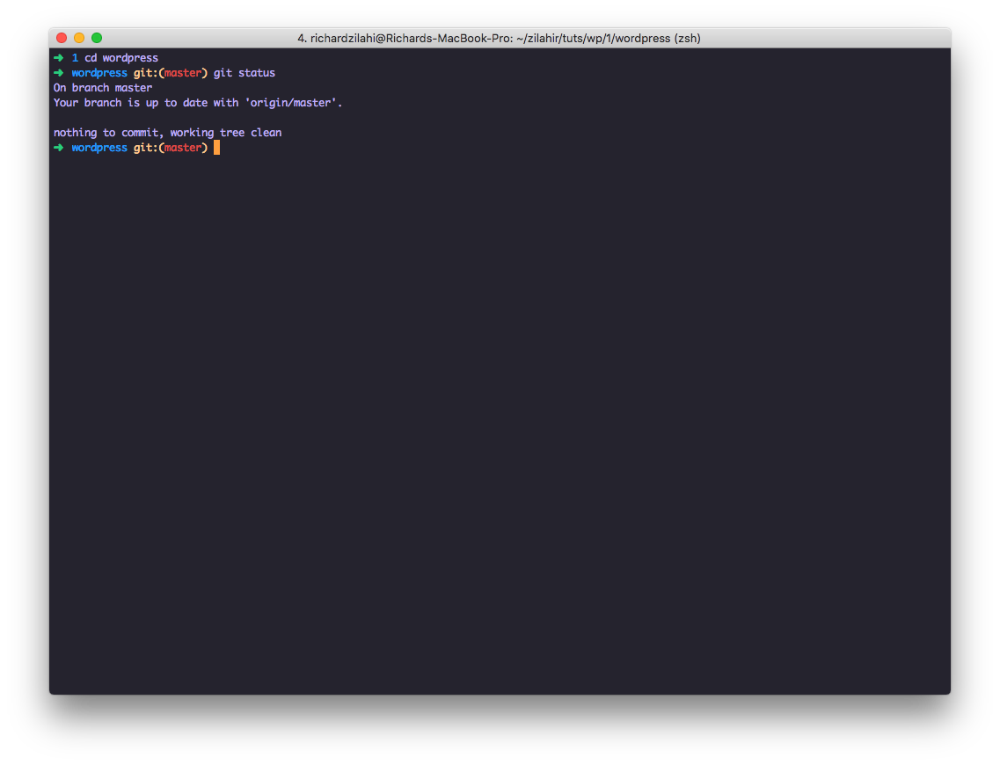
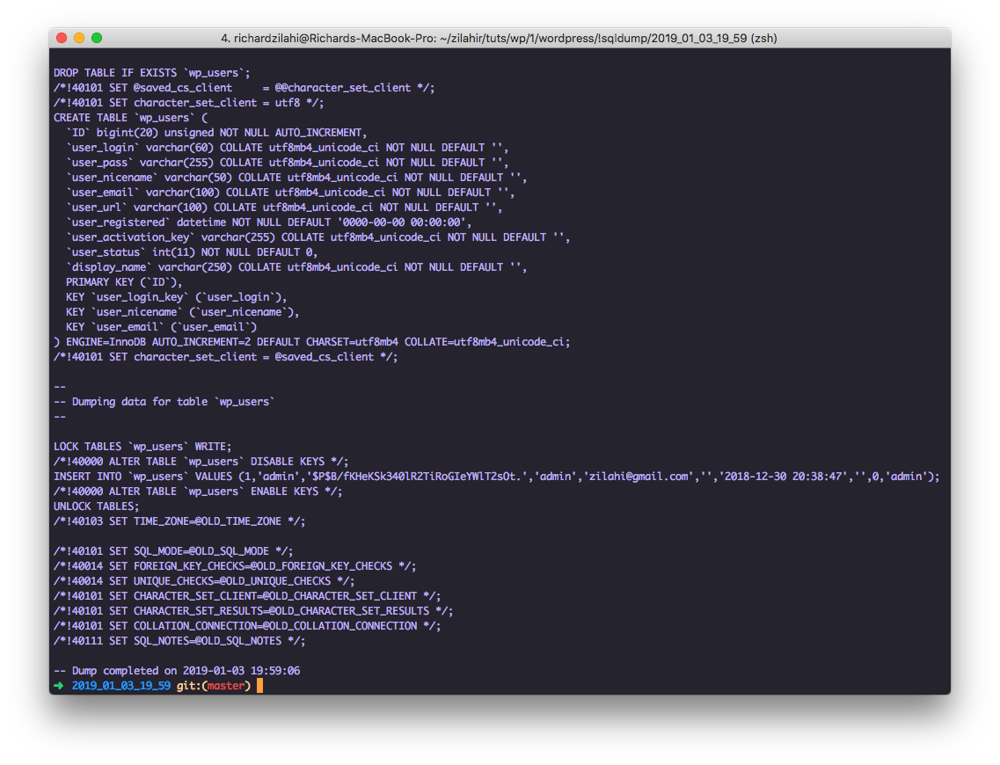

Az [előző](https://blog.richardzilahi.hu/wp-tutorial-1/) összeraktunk egy wordpress fejlesztői környezetet, docker containerrel, webpack-el, MVC patternnel. 

Ebben a posztban pedig összerakunk egy staging körenyezetet, amin az ügyfélnek tudjuk prezentálni a mile stoneokat. 

_First things first_, ideje hogy a projektnek létrehozzunk egy git repo-t. Én [bitbucket](http://bitbucket.org) bitbucketet fogok használni, mert rettentő elégedett vagyok a pipelinejaikkal, ami fontos, a deploy és egyéb adatbázissal kapcsolatos folyamatok automatizálásához. 

Csináljunk egy új repot tehát. 


Menjünk a terminálba, és navigáljunk a `wordpress` instanceunk folderjébe: 

`/Users/richardzilahi/zilahir/tuts/wp/1/wordpress`

majd pedig

`git init`, amivel `working directory` lesz a mappából.

Régebben csak a theme folderből csináltam working directory-t, de a deployment processt megnehezítette, úgyhogy egy ideje az egész instanceból working dir-t csinálok. 

Ha a `git init` nem hozott létre `.gitgnore` fájlt, akkor hozzunk létre a `root` fodlerben egy `.gitignore` fájlt, és írjuk bele: 

`node_modules/**`

illetve

`vendor/`

Ezzel elérve, hogy a rengeteg node module-llal nem szemeteljük tele a repot. Csakúgy mint a `vendor` esetében. 

A létrehozott bitbucket reponk `url`-je legyen kéznél, szükségünk lesz rá. 

Ha a `git init` után ezt látjuk a kimeneten: 

`Initialized empty Git repository at [...]`, akkor jók vagyunk, és jöhet az első, ún. `initial commit`.

```
git add
git commit -m "initial commit"
git remote add origin _<a te repo url-ed>_
git push -u origin master
```

Amint ezekkel megvagyunk, és visszamegyünk a bitucket felületére, láthatjuk, hogy minden bekerült a repoba. 


Most pedig kapcsoljuk be bitbucketen a pipelineokat. 

Ehhez navigáljunk a bitbucket felületen, a `Pipelines`-ba, majd válasszuk a `Javascript` language template-et, majd `example task`-nak pedig a `Heroku`-t. Majd, `Commit file`.


Húzzok le ezt a fájlt a repobol, hogy meglegyen nálunk is. 

`git pull`

És most érkeztünk el az érdekesebb részéhez. 

Először is, szükségünk lesz [`Heroku CLI`](https://devcenter.heroku.com/articles/heroku-cli#download-and-install)-re

Töltsük, le és installáljuk.

Én `brew`-t használok, de van standalone változata is: 

`brew install heroku/brew/heroku`


A sikeres install után valami ilyesmi lesz látható a console-on: 

```
==> heroku
To use the Heroku CLI's autocomplete --
```

Természetesen ha nincs még accountunk herokun, akkor legyen. :)

a `cli` után használhatjuk a heroku-s commandokat, úgyhogy jelentkezzünk be: 

`heroku login`


Most pedig hozzunk létre egy új projektet herokun:

`heroku create`


Láthatjuk, hogy lényegében egy másik git `url`-t kaptunk, ide fogunk majd deployolni a bitbucketes repoból. 

Rendben, menjünk tovább. 

A következő lépés, felkészíteni a projektet a deployolosára, és a herokut a fogadására. 

Szükségünk van egy adatbázisra. 

A heroku dashboardon válasszuk az az imént létrehozott projektünkket, majd menjünk a `Resources` tabra, majd az `Addon` listában keressük meg a `ClearDb`-t. 

A `free` verzió tökéletesen elég lesz. 

Amint hozzáadtuk, kattinsunk is rá. 


Ezután valami hasonlót kellene látnunk. 

Látható, hogy van egy adatbázisunk, ami `heroku_` egy szép hisszú hashből áll. 

Jó, ezzel egyelőre több dolgunk nincs. A nevét azért jegyezzük meg.

Menjünk vissza terminálba, és a deployoláshoz szükségünk lesz két fájlra: 

egy `Procile`, illetve egy `composer.json`. 

(Igen a `Procfile`-nak nincsen kiterjesztése.)

Előbbinek ez legyen a tartalma: 

```
web: vendor/bin/heroku-php-apache2
```

utóbbinak pedig: 

```
{ 
    "require": {
    "php": "^5.3 || ^7.0"   
    } 
}
```

Fontos, hogy ez a két fájl is bekerüljön `git`-be! 

Vegyük elő a `wp-config.php` fájlt, de előtte csinálunk róla egy biztonsági mentést: 

`cp -a wp-config.php wp-config.php.backup`


És módosítsunk néhány dolgot: 

```
$url = parse_url(getenv('DATABASE_URL') ? getenv('DATABASE_URL')
: getenv('CLEARDB_DATABASE_URL'));

/** The name of the database for WordPress */
define('DB_NAME', trim($url['path'], '/'));

/** MySQL database username */
define('DB_USER', $url['user']);

/** MySQL database password */
define('DB_PASSWORD', $url['pass']);

/** MySQL hostname */
define('DB_HOST', $url['host']);

/** Database Charset to use in creating database tables. */
define('DB_CHARSET', 'utf8');

/** The Database Collate type. Don't change this if in doubt. */
define('DB_COLLATE', '');
```

Illetve vannak `AUTH_KEY`, `SECURE_AUTH_KEY` is a `wp-config`-ban, ezeket is le fogjuk cserélni `herokus` `enrivonment` változókra. 

```
define('AUTH_KEY',         getenv('AUTH_KEY'));
define('SECURE_AUTH_KEY',  getenv('SECURE_AUTH_KEY'));
define('LOGGED_IN_KEY',    getenv('LOGGED_IN_KEY'));
define('NONCE_KEY',        getenv('NONCE_KEY'));
define('AUTH_SALT',        getenv('AUTH_SALT'));
define('SECURE_AUTH_SALT', getenv('SECURE_AUTH_SALT'));
define('LOGGED_IN_SALT',   getenv('LOGGED_IN_SALT'));
define('NONCE_SALT',       getenv('NONCE_SALT'));
```

Jó, ezután nyissok meg [ezt](https://api.wordpress.org/secret-key/1.1/salt/) a linket, ami generál nakünk `salt`-okat, amiket aztán egyesével felveszünk `env` varnak. 

Nekünk csak az értéke fog kelleni, tehát a két ` ' ` között lévők.

Így pl ebből: 

```
define('AUTH_KEY',';|h2oyEsP++y<`_?Ho<(2 >x6=]-n+ulUdRhlv>MY+oa(MDTq|,O5j?jJL.f]y[j');
```

erre van szükségünk: 

```
;|h2oyEsP++y<`_?Ho<(2 >x6=]-n+ulUdRhlv>MY+oa(MDTq|,O5j?jJL.f]y[j
```

Ha megvagyunk, nincsmás dolgunk csak 

`git add -A`
`git commit -m "test deploy"`
`git push`
`git push heroku master`

Az 1. `git push` a bitbucketes repóba komittol, a második pedig elindítja a buildet. 

Itt fontos megjegyeznem valamit, amire 1 óra debuggolás után jöttem rá. 

a `wp-content/plugins/wordpress-theme-framework` folderből ki kell törölni a `.git` foldert. Ez azért van ott, mert `git clone`-nal húztok le az original repobol. Az oka pedig, amiért erre nincs szükség, az az, hogy mi csináltunk egy repot az egész wp `instance`-nak. Ezért a mi git reponk tartalmazott egy cloneozott git repot, ezért amikor `git push -u origin master`-ral feltoltuk bitbucketbe, a `wordpress-theme-framework` nem került fel. Bővebben a [`git submodule`](https://git-scm.com/docs/git-submodule) dokumentációban található. 

Azonban a `git rm .git/` önmagában még nem elég, mert ez dobni fog nekünk egy `fatal: in unpopulated submodule` error-t. 

Hogy túljussunk ezen is, nem kell más mint 

`git rm --cached wp-content/plugins/wordpress-theme-framework`

Ezután, ha tolunk egy `git status`-t, láthatjuk, hogy `untracked` lesz a plugin folder:


Innenstől a szokásos eljárás: 

```
git add -A
git commit -m "adding missing plugin folder from repo
git push
git push heroku master
```

Valami ilyesmit kellene látni az outoutban:

```
remote: -----> Compressing...
remote:        Done: 22.3M
remote: -----> Launching...
remote:        Released v14
remote:        https://wp-rz-demo.herokuapp.com/ deployed to Heroku
remote:
remote: Verifying deploy... done.
```

Ezután, ha meglátogatjuk a projektünk `url`-jét, ennek a képnek kell fogadnia: 


Ez pedig tudjuk, hogy azért van, mert az adatbázisunk még üres. 
A teendőnk annyi, hogy a containerben lévő mysql szerverbe belépve, dumpljuk a wordpress adatbázisát. 

Én adatbázis dumplolásra command line `mysql`-t hazsnálok, de demonstrációs célokból, most `Sequel Pro`-t fogok használni, de bármilyen más adatbázis kliens megfelel természetesen. 

Nyissuk meg. 

Mivel az adatbázisunk egy docker containerben fut, a host ebben az esetben 

`0.0.0.0`. 

A username, és pass pedig az amit megadtunk a `docker-compose` fájlban. A port `32768`. (Ide bindel a docker).

Én csináltam egy `sql` foldert a `wordpress` folderben. Azért szeretem gitben tárolni a dumpolt sql fájlokat, mert így könnyen vissza lehet állni egy korábbi verzióra, ha minden gitben van. 

Ezután importálnunk kell ezt az adatbázist a heroku-s adatbázisunka is. 

Szintén `Sequel Pro`-t fogok használni ahhoz, hogy csatlakozzak a remote adatbázishoz. 

Ebben az esetban a `host`-ot megtudhatjuk ha a `Heroku` dashboardon a `Settings` fülre navigálunk, `Show Config vars`, és kikeressük a `CLEARDB_DATABASE_URL` értékét. 

Nem az egész kell csak a `@` jel utáni cím: 

Nekem ez `us-cdbr-iron-east-01.cleardb.net`. 

A `db_name` az adatbázisunk neve, esetemben `heroku_5c6fb88b49c20dc`. 

Nyissuk meg a Herokus adatbázist. 

`Heroku` -> `Resources` -> `ClearDb`

A `credential` pedig a `System Information` alatt találjuk meg. 


Ezután már csak importálni kell az előzőleg dumpolt adatbázist. 


Két fontos dolgot ne felejtsünk el azonban, átírni a `site_url`, és a `home_url` értékeket. 

Ezek az `options` táblában találhatók: 


Az új érték pedig a heroku-s alkalmazásunk url-je lesz, ami az én esetemben: 

`https://wp-rz-demo.herokuapp.com`. 


Ezután, ha mindent jól csináltunk, és most megnitjuk a szájtot: 


##Most pedig jöjjön az igazi móka. 

Mi szokott lenni a legnagyobb gond, egy wp szájt fejlesztése közben akkor, ha azt folyamatosan deploylni kell kaz ügyfélnek, azok meg netán közben használják is, és mindenfélével megtelik közben az adatbázis? 

Számora az, hogy ilyenkor lesz két (vagy három, ha van `dev`, `staging`, és `prod` környezet is) adatbázis is. 

(Most ennek az üzleti részébe nem szeretnék belemenni. Szokott jó oka lenni ezeknek.)

Ha úgy kezdünk el fejleszteni, hogy közben az ügyfélnél lévő instance adatbázisban történtek olyan változások, amik nálunk nincsenek meg, akkor kellemetlen helyzetbe hozhatjuk magunkat. 

Többféle megoldással kísérleteztem, és arra is rájöttem, hogy jó, ha deplyololáskonként készül(nek) beackup(ok) az adatbázis(ok)ról. 

A kézzel dump + import mágikus kombináció rettentő unalamas tud lenni, különösen olyankor ha egy wordpressre épülő webalkalmazás esetében akár többen is vagyunk rajta fejlesztők. 

Sok álmatlan éjszaka után, én a következő workaround-dal rukkoltam elő:

Segítségül hívtam az ún [`git hook`](https://git-scm.com/book/uz/v2/Customizing-Git-Git-Hooks)-okat. Van róluk egy összefoglaló tutorial videó is [itt](https://www.youtube.com/watch?v=MF72e-12dxE) ha van akinek ez újdonság.

Nagyvonalakban, a `git hook` lehetővé teszi, hogy különböző scripteket futtassunk comittolás, és pusholás közben. 

Pontosan ezt a tulajdonságát fogjuk kihasználni mi is. 

Mire van szükségünk deployolás közben? 

Ha localhoston fejlesztünk, minden bizonnyal gyakran túrkálunk az adatbázisban, új táblákat hozunk létre, módosítunk dolgokat, stb. Tehát ha deployoljuk a kódot, ami tartalmaz olyan adatbázison alapulú függvényeket, ami a remote adatbázison nincs kinnt, akkor jó eséllyel deploy után elhasal az alkalmazás, és jöhet a fájdalmas dump + import kombó. Ezt mindenképpen szeretnénk elkerülni, mert én már jóval többször csináltam életemben, mint szerettem volna. 

Két dolog kell: 

1) `sql dump` localhostról 
2) `sql import` remote-ra. 

Ehhez két bash scriptet fogunk létrehozni, és `hook`-olni őket a repositoryhoz. 

Először is menjünk a `theme` folderben lévő `.git` folderbe. 

Itt ha nyomunk egy `ls -la`-t láthatjuk, hogy rengeteg minden van itt, többek között egy `hooks` folder. 


`cd hooks`

hozzunk létre egy `pre-commit`. (Nincs kiterjesztése). 

`touch pre-commit`

Mivel ez egy script, futtathatóvá kell tenni: `chmod +x pre-commit`

Nyissunk meg egy editorban: 

`code pre-commit`. 


Csináljunk egy `!sqldump` fodlert, a `wordpress` folderben: 

`mkdir !sqldump`

Ide fogjuk menteni a dumpolt sql fájlokat.

A `bash` scriptet, amit használni fogunk kitettem egy [`gist`](https://gist.github.com/zilahir/80cd41a53bc14fcacbcc076f96d64d61)-be. 

Menjünk azért rajta végig, hogy mi is történik: 

Először is lekérjük a dátumot, ami a `.sql` fájlneve lesz, hogy tudjuk követni, mikor adatbáziós verzió is az. 

```
current_date=`date +%Y_%m_%d_%H_%M`;
```

Ezután a scriptünk oda is navigálni ebbe a folderbe: 

```
cd /Users/richardzilahi/zilahir/tuts/wp/1/wordpress/!sqldump
```

Hogy szépen rendezett strukúrát kapjunk, én még csinálok egy `subfolder`-t is a `current_date` változó értékével: 

```
/Users/richardzilahi/zilahir/tuts/wp/1/wordpress/!sqldump
```

És most jön az igazi varázslat: 

```
mysqldump --net_buffer_length="83000" -u wp-user -pwp-password 
-h 0.0.0.0 --skip-extended-insert wordpress - >
/Users/richardzilahi/zilahir/tuts/wp/1/wordpress/!sqldump/
"$current_date"/"$current_date".sql
```

A következőkre kell extra figyelmet fordítani: 

`-u <adatbazis userneved>`

`-p<adatbazis jelszabad>` *nincs szóköz a `p` után. 

`-h0.0.0.0` a docker containerünk miatt. 

`-P <a mysql port>`

A `--skip-extended-insert` után a `wordpress` az adavázisunk neve, amit mi definiáltunk korábban a `docker-compose` fájlban. 

A `>` utáni path-ba fogja elmenteni a `$current_date` változó értékével fémjelzett folderben, ugyanolyan néven, `.sql` kiterjesztéssel. 

Majdnem megvagyunk, de még nincs benne a fájl a repo-ban, igaz? 

Ez történik a következő sorokban:

```
git add /Users/richardzilahi/zilahir/tuts/wp/1/wordpress/
!sqldump/!sqldump/"$current_date"/"$current_date".sql
```

Úgy hiszem, hogy ezzel meg is vagyunk, próbáljuk ki. 

Ehhez kelleni fog valamilyen módosítás a repóban, mert ha nincs mit comittálni, akkor értelemszerűen nem fog lefutni, és jelenleg nincs: 



Hozzunk létre egy dummy fájlt, mondjuk `dummy.txt` néven. 


Látható, hogy most már van mitt komittolni, úgyhogy tegyük is meg. 

```
git add -A
git commit -m "testing pre-commit hook"
```

A kimeneten pedig valami ilyesmit kellene látni: 

Láthatjuk, hogy bár csak egy fájlt hoztunk létre `dummy.txt` néven, 

a `git commit` után lett egy másik is: 

`create mode 100644 !sqldump/2019_01_03_19_59/2019_01_03_19_59.sql`


És mivel van benne `578 insertions(+)` feltételezhetjük, hogy nem üres, de azért nézzünk rá: 

Nézzünk bele az `.sql`-be. 

Ez telivan mint a hetes busz reggel. 

Szuper, toljuk fel a repoba a fájlokat: 

`git push`



Ez visziont magába hordozza azt a megszorítást, és egyben megkövetelést is, hogy a `master` branch-re szigorúan *TILOS* bármit is comittolni, tehát ezt a branchet `protected`-re fogjuk varázsolni. 

Ehhez is csináltam egy `[gist]`(https://gist.github.com/zilahir/5f5c2d6eb6d000d75b031d184f31896f).et. 

A 3. sorban a varázslat 

`protected_branch='master'`

Tehát a `master` branchre mostantól nem fogunk tudni pusholni. 

Felmerülhet a kérdés, hogy akkor hogyan fog kikerülni az alkalamzás a `heroku` környezetre, de a válasz egyszerű:

erre lett kitalálni a `git pull request`, de erről kicsit később. 

Nyissuk meg a fentebb linkelt `gist`-et, másoljuk vágólapra a tartalmát, majd menjünk a már jól ismert `hooks` folderbe, és hozzuk létre a scriptet: 

```
cd .git/hooks
touch pre-push
chmod +x pre-push
```

Ne felejtsük el most sem a `chmod +x`-et, ez teszi futtathatóvá a scriptet. 

Rendben, ha megvagyunk, próbáljuk ki, hogy mit hoztunk itt össze.

Az előbb már létrehoztunk egy `dummy.txt`-t tesztelésre, így ne hozzunk létre új fájlt, de ahhoz, hogy ne legyen clean a `working directory`, írjunk bele valamit: 

`vi dummy.txt`

Írjunk bele valami szöveget, mentsünk el, lépjünk ki, és nézzük meg `git status`-al, hogy van-e bármit is komittolni. 


Úgy tűnik, hogy van, úgyhogy a szokásos

```
git add -A 
git commit -m "testing protected branch"
git push
```

És már kapjuk is az általunk a `pre-push` scriptben definiált hibaüzenetet: 


Ezzel meg is volnánk. 

Így, hogy mostmár a `master` branch protected, hozzunk létre egy újat:

`git checkout -b dev`


`dev` nevet adjuk neki, méghozzá azért, mert jelenleg a `master` brenchen vagyunk, ahogy az eddig a screenshotokon látható is volt, de mi úgy szeretnénk megoldani, hogy a `deploy` csak a `master` branchről induljon, hiszen az alap elgondolás az, hogy _bármi_ ami a master branchre kerül, az már `ready to deploy`. 

Ideje bekonfigolni a bitbucket `pipeline`-okat. 

Ehhez nyissunk meg a wp `instance` `root` folderjében már korábban létrehozott `bitbucket-pipelines.yml` fájlt. 

Itt pedig lépésenként fel kell építenünk, hogy mi történnek a pusholt kóddal. 

Két lehetőségünk van: 

1) minden `git push` alkalmával deployolunk egyet a `heroku`-n lévő környezetünkre, vagy 
2) cisnálunk egy `manual step`-et, és kézzel fogjuk indítani, így csak akkor kerül ki új verzió, amikor azt mi szeretnénk. 

Utóbbit fogjuk csinálni. 

Az előttünk lévő `bitbucket-pipelines.yml` fájlba kezdjük el felépíteni a `step`-eket. 

(Van egy nagyon jó dokumentáció a [`pipeline`](https://confluence.atlassian.com/bitbucket/build-test-and-deploy-with-pipelines-792496469.html)-okról, aki eddig még nem dolgozott ezzel.)

Mivel már a dashboardon komittoltunk kézzel egy fájlt, a tarlmát ürítsük ki, és azt javaslom, hogy inkább kezdjük előlről. 


Tehát, amit itt csinálunk kell az ismét 2 dolog

1) kitolni az egész kódbázist herokura
2) importálni a comittal létrehozott `.sql` fájlt.
3) beállítani hogy ez a a `pipleine` csak a `master` branchre fusson le. 

Essünk neki. 

Természetesen a már megszokott módon, a `pipeline` config fájl megtalálható [`gist`](https://gist.github.com/zilahir/76642a8dfbaa62ffd36e597c2448c5cc)-ben, de vegyük sorról sorra: 

```
pipelines: 
  branches: 
      master: 
        - step: 
            image: node:8
            trigger: manual
            name: push all changes to heroku environment
            script:
              git push https://heroku:$HEROKU_API_KEY@
              git.heroku.com/$HEROKU_APP_NAME.git HEAD:master
```

Ami itt fontos, az pl.:

[`image: node:8`](https://hub.docker.com/_/node/)

Ez is egy `docker-image` ami tartalmazza azokat a `service`-eket, amelyekre a `deploy`-nak szüksége van. 

A `trigger`, és a `name` azok szerintem viszonylag egyértelmáek, de maga a `deploy` az a `script`-ben definiáltaknak megfelelően fog megtörténni, azaz, végrehajt egy `git push` parancsot az általunk előre definiált `heroku` repoba. 

Egy fontos dologra még oda kell figyelnünk. Nem lehet bitbucketben az első `step` manual, de ez nem nem is baj, hiszen egyébként is a biztonság kedvéért deploy előtt buildeljük le az `scss` és `js` fájlokat.

Ezér a `manual` step elé, rakunk egy `default`-ot, ami minden esetben le fog futni. Ez most inkább csak egy placeholder a jelenlegi esetünkben, a következő részben viszont fogok _rendes_ `unit` teszteket írni `javascript`-ben, akkor lesz ennek a stepnek igazán szerepe, most viszont elégedjünk meg ennyivel. :) 

```
- step: 
            image: node:8
            name: run webpack
            script:
              - cd wp-content/themes/wp-demo/assets/src               
              - npm install -g webpack
              - npm install -g webpack-cli
              - npm install
              - webpack
```

Ha nincs ott a `trigger manual` akkor a step autoamtikusan `default` lesz. 

Láthatjuk, hogy `manual` step-ben a `script` tartalmaz `env` változókat, mint pl.: `HEROKU_API_KEY`, vagy `HEROKU_APP_NAME`. 

Ezeket a bitbucket settingsben fel kell venni, de előbb szükségünk van a `heroku`tól egy `API_KEY`-re. 

Ehhez is van egy [kis](https://help.heroku.com/PBGP6IDE/how-should-i-generate-an-api-key-that-allows-me-to-use-the-heroku-platform-api) [olvasnivaló](https://devcenter.heroku.com/articles/platform-api-quickstart#authentication). 

De ami nekünk ebben az esetben kell, az nem bonyolult. 

Terminalban, a `wp instance` folderben üssük be, hogy: 

`heroku authorizations:create`

A kimeneten pedig meg fogjuk kapni a generált `tokent`: 


Másoljuk a tokent a vágólapra, majd navigálunk a `Settings` -> `Repository variables`

Itt hozzuk létre ezt a két változót, a fentebb említett két névvel, azonban arra figyeljünk, hogy a biztonságot szem előtt tartva, a `HEROKU_API_KEY` `encrypted` variable legyen. 

Mivel a `bitbucket-pipelines.yml` fájlt a local-ban módosítottuk, ahhoz, hogy használni tudjuk, fel kell komittolni, úgyhogy a már megszokott módon tegyük meg. 

Mivel új branchen vagyuk az `upstream`-et be kell állítani az új `dev` névre keresztel brenchünkre is: 

`git push --set-upstream origin dev`


Itt az ideje megnézni hogyan muzsikál a `pipeline` a bitbucket dashboardon. 

Ne felejtsük el, hogy a `config` szerint a `pipeline` csak a `master` branchen fut le, ezért épp itt az ideje, hogy megnyissuk első `pull request`-ünket. 

Dashboardon, a bal oldali menüben található is egy `pull request` menüpont. 


Jobb felső sarokban, pedig ott van amit keresünk: `Create pull request`. 


Amit itt csinálunk, az nem más, mint a `dev` branchen lévő kódbázist, rámergeljük a `master` branchre, ami triggerelni fogja a `pipeline`-t. 

Megnyomjuk a `Create pull request` gombot. 


Majd pedig a kék `Merge` gombot, így a merge megtörténik. 


Amennyiben a `merge` sikeres volt, nem volt egyetlen confliktunk sem saját magunkkal. 


Most pedig, menjünk a bitbucket dashboardon, a `Pipelens` menübe. 


Ahogy a screenshoton is látszik a `default` step lefutott, a `manual`, ami magát a `deploy` processt fogja elindítani, még vár ránk, indítsuk el. 


Amennyiben sikeresen lefutott a `deploy` `step`, a kimenet a már ismerős alakot fogja ölteni. 


És még egy dolog hiányzik. 

Ugyan minden comittnál készítünk egy `dump`-ot az adatbázisról, de a `pipeline`-ban még nem kezdtünk vele semmit. 

Nyissuk meg újra a `bitbucket-pipelines.yml` fájlt, és fűzzünk hozzá még egy `manual` step-et. 

```
- step:
            name: dump database from repo to devel database to server
            image: mysql:5.7
            trigger: manual
            script:
              - bash ./change_database_.sh
```

Látható, hogy egy `change_database_.sh` fájlt fogunk futtatni, ami nekünk még nincs meg. 

Hozzuk létre, a `wp instance` `root` folderben. 


A scriptet ebben a [`gist`](https://gist.github.com/zilahir/c2b4187d9a1f1391c3545934cda8fe66)-ben találjátok. 

Természetesen a db `usernevet`, `passt`, `hostot`, és `db-nevet` itt is megfelelően ki kell töleni ahogyan azt már korábban csináltuk. 


##Összegzés 

Összegezzük egy kicsit, hogy mi minden történt ebben a posztban.

1) csináltunk `git` repot a projektnek. 
2) csináltunk egy környezetet a `wp instance`-nak, `heroku`-n.
3) beállítottuk a `configot` a `heroku`-nak a sikeres deployhoz. 
4) írtunk `bash` scripteket `git hooks`-hoz, automatikus sql dumpolásra. 
5) beállítottunk `bitbucket-pipelines`-t, az automatikus deploy processhez `heroku`-ra. 

Nyugodtan próbálkozzatok másféle `pipeline` beállításokkal, attül függően, hogy mit szeretnétek elérni. 

A következő részben összerakunk egy minimal `test-suit`-ot a wordpress oldalunknak. 

Ha van kérdés, javaslat, dobjatok egy [emailt](mailto:zilahi@gmail.com), vagy írjatok [twitteren](https://twitter.com/zilahy).
