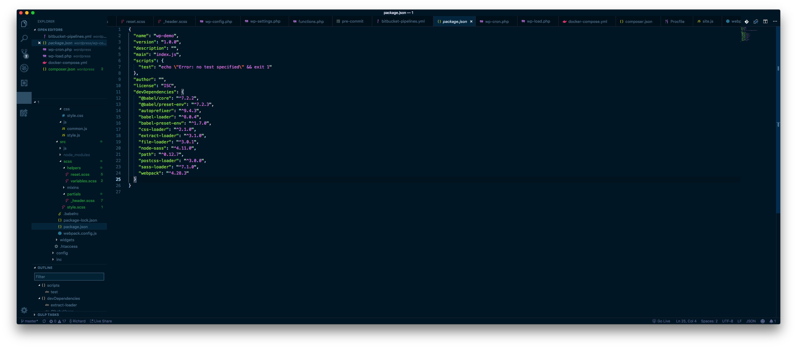
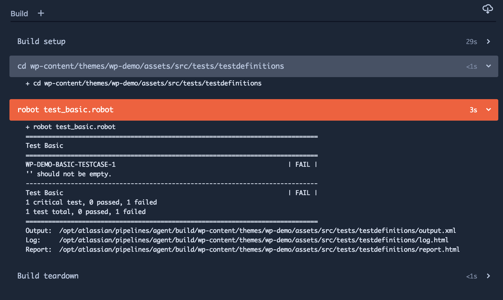

## Minimal unit tesztelés wordpress alatt

Az előző két részben nem csináltunk többet, csak felépítettünk egy fejlesztői környezetet, használtunk `git`-et, `docker`-t, `webpack`-et, `bitbucket-pipelines`-t, `heroku`, írtunk `git hooks` scripteket, stb.

Ebben a részben megnézünk néhány nagyon `basic` tesztelést, hogyan lehetünk egy picivel biztosabbak abban, hogy a `deploy`-olt szájtunk  rendben, elindul, nem hasal el, `js`, és `scss` kódjaink rendben vannak, stb.

Egy `feedback`-ben, a [Wordpress fejlesztők és felhasználók](https://www.facebook.com/groups/wpcsoport/?ref=br_rs&fb_dtsg_ag=AQx8XajeFRP3XaV9pG6lgphwNbivKNfvroPTZr5krkTeNg%3AAQybXuMgFDV9-3cFKODdyq5BoQYvvxtW1Ou48MuC9ur9ZQ&jazoest=28219) csoportban felmerült egy kérdés, hogy _miért is jó ez az egész_, úgyhogy mielőtt belevágunk a mai cikkbe, szeretnék erre reagálni néhány mondatban. 

##Miért csináljuk ezt az egészet? 

Egyrészt elmondom, hogy _én_ személy szerint miért fejlesztek így. 

Ahogyan a webes alkalmazás fejlesztés fejlődik, (és rettentő gyorsan fejlődik) olyan technológiák, eljárások, megoldások jönnek létre, amelyek mind-mind azért vannak, hogy minket, fejlesztőket segítsenek. Gyorsabba, hatékonyabba, biztonságosabban, és kényelmesebben tudjunk fejleszteni. A modern technológiákat segítségül hívva struktuáltabb, átláthatóbb, a mai modern elvárásoknak megfelelő kódbázissal tudunk dolgozni, ami – én úgy gondolom – nem csak a fejlesztő, hanem az ügyfél előnye is. 

Az pedig, hogy amikor elhatároztam, írok egy cikksorozatot arról, hogy _én_ hogyan szeretek nekiállni egy-egy webes projektnek, és ehhez a wordpress-t választottam mint cms, csak azért történt, mert a wp-t egy jó eszköznek tartom arra, hogy mindezt bemutassam. 

Wordpress fejlesztés esetében is érdemes lépést tartani a technológiákkal, mert csak profitálni tudunk belőle. 

Nézzük tehát a jelenlegi rész tartalmát. 

##Eslint

Egy wordpress fejlesztés szerves része a `frontend`-en, a `javascript`, így érdemes odafigyelni arra, hogy milyen minőségű kódot izzadunk ki magunkból. 

A cél, amit ezzel el szeretnénk írni, hogy lefutassunk néhány tesztet, amit a `package.json`-ben fogunk deklarálni, ezáltal használhatók lesznek a `deploy` process során, a `bitbucket-pipelines`-ban is. 

Itt jön képbe az [`eslint`](https://eslint.org/), ami segít betartatni a `codeing pattern`-eket, és `coding rule`-okat. Ez egy nagyon hasznos tool, ami a modern `javascript` technológiákban elengedhetetlen ahhoz, hogy valid, és jól működő js kódot izzadjunk ki magunkkal. 

Menjünk a `themes/wp-demo/assets/src` folderbe, ahol a `package.json` is található. 

Nézzük, hogy hogyan működik. 



Természetesen szükség lesz az `es-lint` module-ra.

`npm install eslint --save-dev`

Ezután, inicializáljuk a lintert: 

`./node_modules/.bin/eslint --init`


Fel fog tenni egy csomó kérdést, mint pl hogy használunk -e `React`-ot, milyen formátumban szeretnénk a `config` fájlt, stb. 


Ezután kapni fogunk egy `.eslintrc` fájlt

Nyissuk meg, és adjunk hozzá néhány `rule`-t 

```
"rules": {
        "semi": ["error", "always"],
        "quotes": ["error", "double"]
    }
```


Ezután nézzük, meg hogy mi történik, ha konzolon lefutattjuk a `test`-et. 

`npm run test`


Hát, úgy tűnik, hogy még ebbe a minimális `js` kódban, és `webpack`-ben is sikerült hibázni, úgyhogy ezeket most javítsuk ki. 

Az egyik, amit észre kell vennünk, és engem nagyon zavar, az pont a `webpack` `error`: 

`1:1  error  Parsing error: The keyword 'const' is reserved`. 

Térjünk ki egy kicsit a `var`, `const`, vs. `let` kérdésre. 

A `let` és a `const` az `EcmaScript5+`-ban lett bemutatva. Az `ES` a `javascript` szabvály, és az [ecma int. association](http://ecma-international.org/) menedzselni. 


Van egy [nagyon jó](https://medium.com/javascript-scene/javascript-es6-var-let-or-const-ba58b8dcde75) összefoglaló a `let` vs. `const` vs `var`-ról, de három mondatban gyorsan vegyük át mi is, hogy értsük mi is történik a `webpack`-ünkben, és a `linter`-ünkben. 

A `const`, és a `let` esetében már az elnevezés teljesen egyértelmű. 

`const`-ot használunk olyna változók deklarálásához, amelyenek értékét az adott `scope`-ban nem szeretnék megváltoztatni. Ez lehet egy állandó pl, amit valamilyen `rest` api ad vissza, akár egy `url`, vagy ilyesmi. 

A `let` ezzel ellentétben olyan deklaráció, melynek értékét, az adott `scope`-ban módosíthatjuk, mint pl `loop`-okban: 

```
for (let i = 0; i<someObject.length; i++) {
    console.debug("currentObject", somObject[i])
}
```

Egyébként `ES5`, és afölött igyekezzünk kerülni a fenti példához hasonló ciklusokat, használjunk helyette `map`-ot, vagy más alternatívát. 

Azt tudni kell, hogy a `linter` alapból ES5 syntaxot ellenőriz, ami azonban még nem tartalmazza a `const` annotációt, így kicsit módosítanunk kell az `.eslintrc` ` `config`-on. 

```
{
    "extends": "eslint:recommended",
    "rules": {
        "semi": ["error", "always"],
        "quotes": ["error", "double"]
    },
    "parserOptions": {
        "ecmaVersion": 2017
    },

    "env": {
        "es6": true
    }
}
```

Csak annyit csináltuk, hogy megmondtuk a `linter`-nek, hogy `"ecmaVersion": 2017`-es sytanxot ellenőrizzen. 

Ennek fényében, futassunk újra a test scriptünket: 


Na, sokkal jobbnak tűnik, ugyanis mostmár tele van hibával a `webpack.config.js` fájl is. 

Javítsuk ki a hibákat gyorsan. Láthatjuk, hogy van egy csomó `single` és `double` quote próbléma, `undefined` értékek, stb. 

Minden szabály ami szerint a `linter` dolgozik megtalálható az [`eslint.org`](https://eslint.org)-on, érdemes utánanézni a fenti screenshoton látható hibáknak, hogy pontosan miért is kapjuk őket. 

Nézzünk meg egy példát: 

`2:19  error  Missing semicolon          semi`

Maga a `js`, amire ezt a hibát kapjuk: 

`alert("hello")`

A `semicolon`-t ` ; ` hiányolja, amit viszont én már nem szoktam írni, hiszena  `js` engine tudja magától, hogy mi a dolga. 

<aside>
JavaScript is unique amongst the C-like languages in that it doesn’t require semicolons at the end of each statement.
<a href="https://eslint.org/docs/rules/semi">Forrás</a>
</aside>

Azonban, ahhot, hogy a `linter`-ünk is tudja ezt, meg kell neki mondani, hogy _pls, nem kell semicolom_: 

`.eslintrc`, és definiáljunk egy új [`rule`](https://eslint.org/docs/rules/semi)-t. 

```
"rules": {
        "semi": ["error", "never"],
```

Módosítsuk ennek megfelőlen a `src/js/site.js` fájlunkat: 

```
document.addEventListener("DOMContentLoaded", function() {
    alert("hello")
})
```

Nincs több ` ; ` 

Futtasuk újra a `linter`-t.


A `;` hiba eltűnt, de még mindig van ott két furcsaság: 

```
1:1  error  'document' is not defined  no-undef
2:5  error  'alert' is not defined     no-undef
```

Nézzük meg mint mond ezekre a `linter` [dokumentációja](https://eslint.org/docs/user-guide/configuring#specifying-environments). 

`include`-olnunk kell a `global` változókat ahhoz, hogy megoldjuk ezt a problémát. 

`.eslintrc`: 

```
"env": {
    "browser": true,
    "node": true
}
```

Ezután, ha újrafuttatjuk a `linter`-t, láthatjuk, hogy a `site.js`-ben nincs több hiba, azonban a `webpack.config.js`-ben még mindig sok van, de csak két `rule`-ra panaszkodik: 

1) `semi`
2) `quotes`

Nézzük meg ezeket: 

`webpack.config.js:1`:

`const path = require("path")`

Ninc szükség a `;`-ra: 

`const path = require("path")`

Ezzel meg is vagyunk, az öszes többi `quote` probléma, nézzünk rá mégegyszer milyen `rule`-t adtunk meg ehhez az `.eslintrc` configban: 

`"quotes": ["error", "double"]`

A [`rule`](https://eslint.org/docs/rules/quotes#enforce-the-consistent-use-of-either-backticks-double-or-single-quotes-quotes) definíciója szerint: 

`enforce the consistent of quotes`

Tehát, itt arra panaszkodik, hogy hol `single` ` ' `, hol `double` ` " ` `quote`-ot használtunk. És valónban: 

```
  loader: "babel-loader",
    options: { 
    presets: ['@babel/preset-env']
```

Úgyhogy most essünk neki kicserélni mindenhol a `single`-t `double`ra, én ugyanis azt preferálom. 

Amint megvagyunk, újrafuttatjuk a `test`-et, és voilá, eltűnt az összes linter error, így már biztosak lehetünk benne, hogy a `js` kódunk szintaktikailag helyes, és a `webpack` sikeresen le fogja fordítani. 


##Basic tesztelés 

Tesztelsében sokáig el voltam maradva, és talán még mindig egy picit _oldschool_ vagyok, viszont nem tartozott soha a kedvenc elfoglaltságaim közé, illetve manapság egy cégnél már vannak erre dedikált csapatok, viszont, `freelance` munkakörben, vagy egyszemélyes projekteknél még mindig elengedhetetlen a rendes, normális, átgondolt, tervezett és implemenált tesztelés, még akkor is ha _it's a real pain in the ass`. 

Megmutatom, én hogyan szoktam tesztelni. 

Jónéhány éve már, hogy rátaláltam a `RobotFramework` nevű, teljesen `open source` `testautomation` toolra, és mivel már akkor is szerettem volna elmenni a KDT (`Keyword Driven Testing`) irányába, engem ezzel az eszközzel, úgy 2013 környékén megvettek kilóra. Ha feljön az `RF` mint topik, érdekesség képpen el szoktam mondani, hogy a finn, szebb napokat megeélt `Nokia` neve alatt indult ez au initial fejlesztés, [Pekka Klärck](https://twitter.com/pekkaklarck?lang=fi) dédelgető kezei alatt lett – és túlzás nélkül merem, és lehet állítani – a világ vezető `test automation` toolja. 

Essünk is neki.

Hozzunk létre egy `tests` foldert valahol, mondjuk az `src`-ben. (Aztán meglátjuk, hogy ez jó ötlet volt-e). 


Szükségünk lesz természetesen `RobotFramework` installra, ehhez ovassuk el a hivatalos [dokumentációt](https://github.com/robotframework/robotframework/blob/master/INSTALL.rst). Ha van már `python bin` installálva a gépünkre, akkor nem is kell mést tenni csak használni a `python` hivatalos [`package manager`](https://pip.pypa.io/en/latest/reference/pip_install/#pip-install)-jét használni. 

`pip install robotframework`. 

Kelleni fog néhány `RobotFramework Library`, első körben: 

1) [`Selenium2Library`](http://robotframework.org/Selenium2Library/Selenium2Library.html)
2) [`HTTP Library`](https://github.com/peritus/robotframework-httplibrary)

A `tests` fodlerben vagyunk, szükségünk lesz még két másikra, csak hogy rendezettek maradjunk: 

`mkdir testdefinitions`, illetve
`mkdir resources`

Előbbibe maga a tesztesetek kerülnek, utóbbiba pedig a tesztek implementációja. 

##Milyen teszteseteket írjunk? 

Ez egy nagyon jó, és fontos kérdés. Első körben mondjuk nézzük meg, hogy egyáltalán bejön-e az oldal, és nincs mondjuk `db error`. 

Hozzuk létre a fájlokat, kelleni fog néhány. 

`cd testdefinitions`. 

`touch test_basic.robot`. 

`cd ..`
`cd resources`
`touch global.robot`
`touch variables.robot`

Nyissuk meg a fájlokat valamilyen `IDE`-ben, és essünk neki a tesztesetek implementációjának.

A `RobotFramework` `KDT` ugyan, de `python` alapú. Az előre definiált `keyword`-ökkel ugyan viszonylag széles körű funkcionalitást lefedhedhetünk, de bármikor kiegészíthetjük saját `python` implementációval. 

Mi most nem fogunk nagyon mélyen belemenni, a Selenium `python` implementációját fogjuk használni, ami a `Selenium2Library` nevet kapta. 

Írjuk mg az első `testcase`-ünket, ami nem fog többet csinálni, csak megnyitja az általunk megadott `url`-en a wordpress szájtunkat, egy `headless browser`-t használva. 

<aside>
Bárilyen <code>headless</code> browser implementációt használhatunk. 1-2 éve én még a <a target"_blank" href="http://phantomjs.org/">phantomJS</a>-t használtam, de a <code>Chrome 59</code>-től kedzve már a chrome-nak is van <a target="_blank" href="https://developers.google.com/web/updates/2017/04/headless-chrome">headless</a> verziója, és nekünk itt most ez utóbbi bőven elég. 
</aside>


Nézzük, hogyan néz ki a `testcase`: 

```
*** Settings ***
Resource                     ./../resources/global.robot 

*** Variables ***

*** Test Cases ***
WP-DEMO-BASIC-TESTCASE-1
    [Tags]                     owner-richard.zilahi  
    group=basic-test
    Open Wordpress              ${WORDPRESS_URL}

    [Teardown]                  Run Keywords    
    Close All Browsers
```

Vegyünk észre néhány dolgot: `${WORDPRESS_URL}`, `Open Wordpress`. 

Előbbi `variable` (--> `variablel.robot`) utóbbi `keyword` (--> `globals.robot`) név. Ezeket kell implementálnunk. 

Először deklaráljuk ezt a `${WORDPRESS_URL}`-t. 

Nyissuk meg a `variables.robot` fájlt. 

```
# VARIABLES

*** Settings ***

*** Variables ***

${WORDPRESS_URL}=   http://localhost
```

Meg is van, implementáljuk most magát a `testcase`-t. 

Kipakoltam [`gist`](https://gist.github.com/zilahir/48e1d22ea52f009cd0843693f7243f22)-be ezt a kis demo tesztet. 

Mit csinálunk itt? 

Először is megnyitjuk a `chrome`-ot `headless` módon, átadjuk neki a szájtunk `url`-ét paraméterként, utána pedig elkérjük az oldal `title` tagjét, és ellenőrizzük. 

A `Selenium2Library` [keyword listájában](http://robotframework.org/Selenium2Library/Selenium2Library.html#Get%20Title) létezik `pre-defined` `keyword` erre a célra. 


`Get Title`

Láthatjuk a doksiban, hogy nincs egyetlen paramétere sem, így csak meghívjuk, és az értékét `assign`-oljuk egy `${Title}` változóhoz. 

`${PageTitle}=     Get Title`

Írjunk rá valami nagyon `dummy` ellenőrzést, mondjuk vizsgáljuk meg, hogy üres-e ez a `String`, és ha igen akkor `fail`-eljünk el. 

Láthattuk, hogy a `global.robot` fájlban egy csomó `Library` be van húva, többek között a `BuiltIn`. 

Üssük fel a [dokumentációját](http://robotframework.org/robotframework/latest/libraries/BuiltIn.html), és keressünk egy [`Should Not Be Empty`](http://robotframework.org/robotframework/latest/libraries/BuiltIn.html#Should%20Not%20Be%20Empty) `keyword`-öt. 


Egy paramétert vár, egy `item`-et. 

Adjuk hát meg neki amit kér. 

`Should Not Be Empty     ${PageTitle}`

Ahogy a dokumentáció is mondja, `Verifies that the given item is not empty.`, vagyis ha mégiscsak `empty` akkor ez el fog hasalni. 

Na, próbáljuk is ki. [Itt](http://robotframework.org/robotframework/latest/RobotFrameworkUserGuide.html#executing-test-cases) található a futtatásról szóló dolgok a hivatalos dokumentációban, de nem `rocket science` azért: 

`robot test_basic.robot`

A kimenet pedig: 

```
  ============================================================
  Test Basic
  ============================================================
  WP-DEMO-BASIC-TESTCASE-1                            | PASS |
  ------------------------------------------------------------
  Test Basic                                          | PASS |
  1 critical test, 1 passed, 0 failed
  1 test total, 1 passed, 0 failed
  ============================================================
```

Hát, ez teljes siker, az 1 `ciritical` testből 1 át is ment. Ennél boldogabbak gyakorlatilag nem is lehetnénk. :) 

A lehetőségek wordpressel gyakorlatilag végtelenek, természetesen tudni kell, hogy mit tesztelünk, egy posztokból álló blogot nagyjából felesleges, de ha valaki egy komolyabb webappot épít wordpress cms alapokra, ott a tesztelés már elmaradhatatlan, sőt, külföldi ügyfelek a dokumentáció mellé manapság a teszt forgatókönyveket, és a tesztek forráskódját is elkérik. Ez wordpressnél is megtörténik, `React` esetében pedig kivétel nélkül mindig, ott ugye az [`Enzyme`](https://airbnb.io/enzyme/) a `test tool`. 

Ha valaki `webshop`-ot üzemeltet, és van mondjuk online fizetés, ott már igazán hasznosan jöhet a tesztelés, hogy végigautomatizálja a folyamatot, a kosár telepakolásától kezdve leennőrizni a `Vásárlás sikeres` üzenetet, létezik `Database Library` amivel csatlakozhatunk a `wordpress` adatbázishoz, és ellenőrizhetjük, hogy valóban befutott-e a rendelés, stb. 

Ha csak egy egyszerű `plugin`-t fejlesztünk, ott is hasznos lehet, hiszen nem kell a frontenden mindig végignyomkodni a folyamatot, fejlesztés közben. 

Ha valakiben felmerülne a `KDT` létjogosultsága, annak csak néhány jellemzőt, a legfontosabbak közül: 

1) Ennél nem lehet könyebben, és gyorsabban tesztet írni 
2) Ennél nem lehet könyebben, és gyorsabban karbantartani, esetenként több száz tesztesetet
3) Mivel python alapú, könnyű bármilyen kiegészítést implementálni benne

Létezik hozzá [`docker-image`](https://github.com/ppodgorsek/docker-robot-framework), így a tesztek minden minden további nélkül futtatható az előző részben már megírt `bitbucket-pipeline`unkban, úgyhogy nézzük is meg. 

Viszint a fentebb linkelt `docker-image` csak a `SeleniumLibrary` szerepelt, nem pedig a `Selenium2Library`, így [`fork`]((https://github.com/zilahir/docker-robot-framework))-oltam, és csináltam belőle magamnak egyet, amit használhattok ti is bátran. 

<aside>
Az előző részben beállított <code>manual</code> <code>pipeline</code> step-et kivettem, a <code>master</code> branch-et átírtam <code>dev</code> így nem kell mindig <code>pull request</code>-et létrehozni, csak a teszetelés kedvéért. </aside>

Lássuk, hogyan adjuk hozzá a `RobotFramework` `docker-image`-et a `bitbucket-pipeline`-hoz, és hogyan fogjuk lefuttatni a tesztjeinket. 

```
- step:
    name: run RF tests
    image: zilahir/docker-robotframework
    script: 
        - cd wp-content/themes/wp-demo/assets/src/tests/testdefinitions
        - robot test_basic.robot
```

Azért gondoljuk át, hogy hova is tegyük ezt a lépést. 

Mivel tesztelni akkor szeretnénk, ha a deploy lefutott, azért tegyük a deploy step elé. 


Komittoljuk fel a fájlt, és mivel átírtuk a `dev` branchre a `pipeline`-t, automatikusan el fognak indulni a step-ek. 

Nézzük is. 



Álljunk csak meg egy pillanatra! 

Hát ez bizony elhasalt. De tudjuk, hogy miért: 

`'' should not be empty.`

Vagyis, a `<title>` amit ellenőrzünk, bizony üres, márpedig ez volt az egyetlen feltétel, amit implementáltunk. 

Viszont, a jó hír, hogy tudjuk, hogy miért. 

`Open Wordpress              ${WORDPRESS_URL}`

a `${WORDPRESS_URL}` pedig (`variables.robot)` --> `${WORDPRESS_URL}`, márpedig a `bitbucket pipeline`-ban futó `docker` tuti, hogy nem lát ki a mi kis gépünkre. 

A megoldás, hogy definiálunk egy új `bitbucket` változót, aminek az értéke a `heroku`-s szájtunk `url`-je lesz. 

Menjünk a `bitbucket` dashboard-on, a `Settings` --> `Repository variables`-be, és hozzuk létre a változót: 


Szemfülesek észreveheteik, hogy az `url`-t fel lehetne építeni a `HEROKU_APP_NAME` változóból, de én létrehoztam neki egy újat, ugyanis `heroku`-ban van lehetőség megadni más `url`-eket, ha esetleg a `staging` mellett a `production` verziónk is itt futna. 

A `robot` `python` parancsnak adható át [`command line`](http://robotframework.org/robotframework/latest/RobotFrameworkUserGuide.html#setting-variables) paraméter, így nem vagyunk bajban azzal, hogy átadjuk neki a `HEROKU_APP_NAME` változónk értékét. 

Ehhez a `bitbucket-pipeline`-t a következő módon módosítsuk: 

`robot --variable name ${SITE_URL}:${HEROKU_APP_NAME}`

Ehhez persze át kell írni a változó nevét magában a `testdefinition`-ben is: 

`Open Wordpress              ${SITE_URL}` 

Természetesen ez úgy lenne szép, ha `environment`-et adnánk át, a `testdefinition`-ben pedig egy feltétellel ellenőriznénk, és ez alapján adnánk át a tesztesetnek a szájtunk `url`-jét, de talán már ez a példa is jó kiindulás lehet. 

Jó, próbáljuk is ki.

```
git add -A
git commit -n -m "testing RF tests on remote" 
git push
```

Majd nézzük meg a `pipeline` futását. 


Mivel a `deploy` `step` maradt manual triggeren, ezért arra kézzel nyomjunk rá. 


És láthatjuk, hogy a `testcase` sikeresen lefutott, így ezáltal success a `pipeline` is. 

Természetesen lehet még ezt szépíteni, hiszen ha a `testcase` el failelt, akkor érdemes lenne `revert`-elni az előző `stable` verzióra, stb. 

```
============================================================
Test Basic                                                                    
============================================================
WP-DEMO-BASIC-TESTCASE-1                            | PASS |
------------------------------------------------------------
Test Basic                                          | PASS |
1 critical test, 1 passed, 0 failed
1 test total, 1 passed, 0 failed
```

Úgy érzem, hogy sikerült bemutatnom az előnyeit, és lehetőségeit a `RobotFramework`-nek, és jól látszik, hogy a tesztelési lehetőségek szinte végtelenek, és rendkívül könnyű használni, viszont az életünket igen jelentős mértékben meg tudja könnyíteni, és érdemes is erre is figyelnünk, nekünk fejlesztőknek, még akkor is, ha idegenkedünk tőle.  
